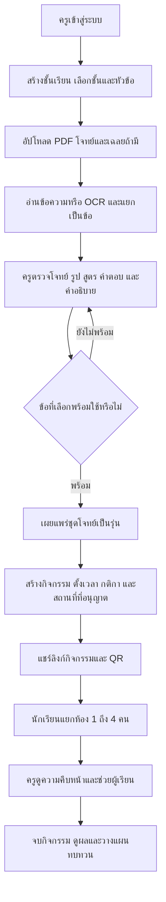
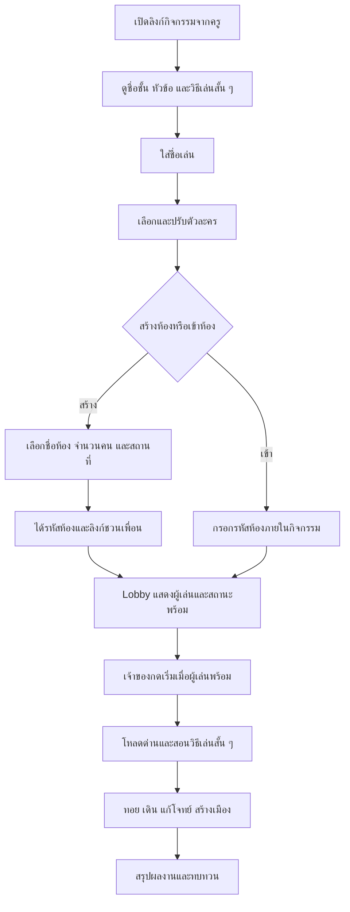
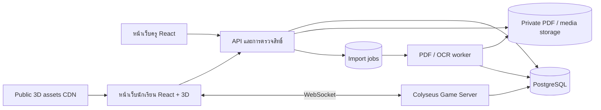

# Workflow สำหรับ Terra: เกมเศรษฐีฟิสิกส์ 3 มิติสำหรับห้องเรียน

เอกสารส่งมอบงานออกแบบและพัฒนา • 22 กันยายน 2026 • ฉบับ 1.0

เอกสารนี้เป็นข้อกำหนดของงานที่จะพัฒนา ไม่ใช่รายงานว่าโปรเจกต์ปัจจุบันทำฟีเจอร์เหล่านี้เสร็จแล้ว ตัวเลขราคา เวลา จำนวน asset และประสิทธิภาพเป็นค่าเริ่มต้นที่ต้องทดลองและตรวจรับ

## 1. คำสั่งเริ่มงานสำหรับ Terra

> อ่าน `TERRA_WORKFLOW.md` ทั้งไฟล์ แล้วปรับปรุงโปรเจกต์ปัจจุบันตาม workflow นี้ให้เป็นเกมเศรษฐีฟิสิกส์ 3 มิติที่ครูนำไปใช้ในชั้นเรียน ม.2 ม.4 และ ม.5 ได้จริง ดำเนินการตาม Phase 0–10 และตรวจเกณฑ์ผ่านของแต่ละช่วงก่อนเดินหน้าต่อ ใช้โค้ดเดิมที่เหมาะสม รักษางานที่มีการแก้ไขค้างอยู่ และบันทึกความคืบหน้าใน `IMPLEMENTATION_STATUS.md` อย่าจบงานที่หน้า mockup, รูปที่ดูเหมือน 3 มิติ, ห้องเล่นจำลอง หรือ PDF ที่อัปโหลดแล้วนำโจทย์มาใช้ไม่ได้ ตัดสินใจเรื่องย่อยตามค่าเริ่มต้นในเอกสารและบันทึกเหตุผลใน `DECISIONS.md` เมื่อมีข้อจำกัดจากบริการภายนอก ให้ทำส่วนที่ไม่ติดข้อจำกัดต่อ พร้อมระบุสิ่งที่ยังต้องตั้งค่าอย่างตรงไปตรงมา

**ลำดับความสำคัญ:** ความถูกต้องของโจทย์และกติกา → เล่นพร้อมกันได้จริง → ใช้งานครบเส้นทางครูถึงนักเรียน → งานภาพ 3 มิติที่สวยและลื่น → ขยายเนื้อหา

- เอกสารนี้แทนข้อกำหนดเดิมใน `CODEX_WORKFLOW.md` เฉพาะส่วนที่ขัดกัน เช่น Phaser เป็นภาพหลัก, การใช้ภาพ placeholder เป็นงานภาพสุดท้าย, การลงโทษตอบผิดด้วยคุก และการรองรับเฉพาะ ม.ปลาย
- อย่าลบไฟล์เดิมหรือทิ้งงานที่ยังไม่ได้ commit เพื่อเริ่มใหม่ ใช้ feature flag และการย้ายทีละส่วน
- การทำงานต่อเนื่องไม่ได้แปลว่าต้องประกาศสำเร็จในการรันครั้งเดียว หากยังมีงานให้บันทึกสถานะและจุดเริ่มต่ออย่างชัดเจน
- ยังไม่รวมการซื้อ asset, สมัครแพ็กเกจเสียเงิน หรือเผยแพร่สาธารณะโดยอัตโนมัติ เตรียม build และ staging ที่ตรวจรับได้ก่อน และดำเนินการภายนอกตามสิทธิ์ที่ผู้ใช้ให้ไว้
- ห้ามรายงานว่า OCR, multiplayer, QR, การกู้คืนเกม หรือผลการเรียนทำงานจริงโดยใช้เพียง mock data เป็นหลักฐาน

## 2. ผลิตภัณฑ์ที่ต้องได้

ชื่อใช้งานชั่วคราว: **Physics World: เมืองฟิสิกส์** — เกมกระดานท่องโลก สร้างเมือง และเรียนรู้ฟิสิกส์ร่วมกับเพื่อน

นักเรียนเปิดลิงก์จากครู ใส่ชื่อเล่น เลือกตัวละคร สร้างหรือเข้าร่วมห้องด้วยรหัส เลือกสถานที่ แล้วเริ่มเล่นได้ 1–4 คนบนเว็บโดยไม่ต้องติดตั้งแอป ครูใช้ PDF ของตนเองสร้างกิจกรรม และดูได้ว่าผู้เรียนเข้าใจเรื่องใดหรือควรทบทวนเรื่องใด

### ขอบเขตที่ต้องเสร็จเมื่อส่งมอบครบ

| ด้าน | ผลลัพธ์ปลายทาง |
|---|---|
| ครู | เข้าระบบ สร้างชั้นเรียน สร้างชุดโจทย์จาก PDF ตรวจทาน เปิดกิจกรรม แชร์ลิงก์/QR ดูห้องสดและรายงาน |
| นักเรียน | ใช้ชื่อเล่น เลือกตัวละคร สร้าง/เข้าห้อง เล่น 1–4 คน กลับเข้าเกมเมื่อหลุด และทบทวนหลังเล่น |
| ห้อง | รหัสห้อง เลือกความจุ 1–4 คน เลือกสถานที่ สถานะพร้อม โอนเจ้าของห้อง ล็อกหลังเริ่ม |
| ภาพ | กระดาน ตัวละคร ลูกเต๋า และอาคารเป็นวัตถุ 3 มิติ มีแสง เงา วัสดุ และอนิเมชัน |
| เนื้อหาภาพ | 12 สถานที่ตามข้อ 10, ตัวละครเริ่มต้น 24 แบบ, อาคารแต่ละสถานที่ 4 ระดับ |
| การเรียนรู้ | คำใบ้ เฉลยเป็นขั้นตอน ตอบพร้อมกันระหว่างตา แยกคะแนนเรียนรู้กับทรัพย์สิน |
| อุปกรณ์ | คอมพิวเตอร์ แท็บเล็ต และมือถือ มีคุณภาพภาพต่ำ/กลาง/สูง และหน้ากระดานสำรองเมื่อ 3 มิติใช้ไม่ได้ |
| ใช้งานจริง | บันทึกข้อมูลถาวร กำหนดสิทธิ์ ป้องกันเฉลยรั่ว กู้คืนสถานะ และมีคู่มือครู |

**งานที่เป็นส่วนขยายหลังส่งมอบ:** โลกเปิดเดินอิสระ, VR/AR, voice chat, ห้องเกิน 4 คน, ตลาดซื้อขายเงินจริง, ระบบ AI ติวเตอร์สนทนา และข้อเขียนที่ต้องตรวจระหว่างตา ไม่ใช่เงื่อนไขของรุ่นนี้

## 3. จุดเริ่มต้นจากโปรเจกต์ปัจจุบัน

ตรวจจากไฟล์ใน workspace ณ วันที่จัดทำเอกสาร:

| มีอยู่แล้ว | แนวทางต่อยอด |
|---|---|
| `client/` ใช้ Vite, React 18, Phaser, Zustand | เก็บ React/UI/network; เพิ่ม Three.js ผ่าน React Three Fiber และย้าย renderer |
| `server/` ใช้ Node, Express, Colyseus 0.16 | เก็บการตัดสินเกมที่ server; เพิ่มกิจกรรม การยืนยันตัวตน และ persistence |
| `shared/src/gameRules.ts`, `boardConfig.ts` | แยกกติกาจากธีม คงกระดาน 28 ช่อง และเพิ่มกติกาห้องเรียน |
| โจทย์ JSON 6 หมวด | ตรวจเนื้อหาใหม่ แยกชั้น/หลักสูตร/หัวข้อ/รุ่น ไม่ถือว่าเหมาะกับทุกชั้นอัตโนมัติ |
| ซื้อ อัปเกรด เช่า ประมูล แลกทรัพย์สิน และบอต | ทบทวนสิทธิ์และความปลอดภัย; ประมูล/แลกปิดเป็นค่าเริ่มต้นในโหมดห้องเรียน |
| `tests/gameRules.test.ts` | ขยายเทสต์ที่ตรวจพฤติกรรมเกมหลายคนและการกันข้อมูลรั่ว |
| `render.yaml`, `vercel.json` | ใช้เป็นฐานตั้งค่า deployment และตรวจข้อจำกัดบริการจริงก่อนใช้งาน |

**ข้อที่ต้องแก้ก่อนใช้กับนักเรียนจริง:**

1. `PublicQuestion` และ `publicQuestion()` ตัดเฉพาะ `answerIndex` แต่ยังมี `explanation` อยู่ จึงต้องแยกข้อมูลก่อนตอบกับเฉลยหลังตอบด้วย allowlist ที่ชัดเจน
2. `GameRoom.onJoin()` จับคู่ผู้กลับเข้าห้องจากชื่อเล่น ต้องเปลี่ยนเป็นตัวตนผู้เล่นและ reconnect token; ชื่อเล่นไม่ใช่หลักฐานยืนยันสิทธิ์
3. เส้นทาง `trade` รับ payload โดยไม่ผูกผู้ส่งกับเจ้าของทรัพย์สิน และโอนทันที ต้องปิดไว้จนมีการตรวจเจ้าของและความยินยอมอีกฝ่าย
4. `MiniQr.tsx` เป็นลายกริดตกแต่ง ต้องแทนด้วย QR มาตรฐานและทดสอบสแกนลิงก์จริง
5. การเลือกโจทย์กรองเฉพาะความยาก ต้องบังคับ `assignmentId`, `questionSetVersionId`, หัวข้อ และสถานะครูอนุมัติ
6. `startGame` ปัจจุบันเติมบอตเมื่อคนน้อยกว่า 2 คน ต้องเปลี่ยนให้เริ่ม 1 คนได้โดยไม่เติมบอตเงียบ ๆ และตรวจสถานะพร้อม/สิทธิ์/ห้องทุกครั้ง
7. อย่าสันนิษฐานว่าการส่ง snapshot ปัจจุบันเท่ากับ persistence หรือการ reconnect ที่ปลอดภัย ต้องทดสอบแยกกัน

ขณะตรวจพบงานแก้ไขค้างใน `client/src/App.tsx`, `client/src/game/PhaserGame.tsx`, `client/src/game/scenes/BoardScene.ts`, `client/src/styles.css`, `server/src/index.ts`, `server/src/logic/questions.ts`; Terra ต้องตรวจ `git status` อีกครั้งก่อนเริ่มและรักษางานเหล่านี้

## 4. โครงสร้างชั้นเรียนและสิทธิ์

แยกสิ่งต่อไปนี้ออกจากกัน เพื่อไม่ให้คำว่า “ห้อง” หมายถึงทั้งชั้นเรียนและโต๊ะเล่น:

| หน่วยข้อมูล | ตัวอย่าง | หน้าที่ |
|---|---|---|
| Classroom | ม.2/1 ภาคเรียน 1 | กลุ่มเรียนของครูหนึ่งคนหรือทีมครูที่ได้รับสิทธิ์ |
| Question set | แรงและการเคลื่อนที่ ชุด A | คลังโจทย์ที่แก้ไขเป็น draft และเผยแพร่เป็นรุ่น |
| Assignment | เล่นทบทวนแรง 30 นาที | ผูกชั้นเรียนกับชุดโจทย์รุ่นหนึ่งและการตั้งค่ากิจกรรม |
| Game room | กลุ่มดาวเสาร์ รหัส K7M9Q2 | โต๊ะเล่น 1–4 คนภายในกิจกรรมนั้น |
| Game session | การเล่นครั้งที่ 1 | ผลการเล่นของห้องหนึ่งครั้ง หยุดแล้วคงข้อมูลย้อนหลัง |
| Participant | นักเรียนชื่อเล่น “ฟ้า” | ตัวตนภายในกิจกรรม มีรหัสภายในที่ไม่ใช้ชื่อเป็น primary key |

หนึ่งชั้นเรียนมีหลายกิจกรรม หนึ่งกิจกรรมมีหลายห้อง และแต่ละห้องเลือกสถานที่ต่างกันได้โดยใช้ชุดโจทย์รุ่นเดียวกัน

| บทบาท | ทำได้ | ข้อจำกัด |
|---|---|---|
| ครูเจ้าของ | จัดการชั้นเรียน/PDF/เฉลย ตั้งกิจกรรม ดูข้อมูลและส่งออกผล | เข้าถึงเฉพาะชั้นเรียนที่มีสิทธิ์ |
| นักเรียนเจ้าของห้อง | สร้างห้อง เลือกสถานที่ ตั้งจำนวนคน เริ่มเกม | เปลี่ยนโจทย์ ระดับชั้น หรือเฉลยไม่ได้ |
| นักเรียนร่วมเล่น | เลือกตัวละคร พร้อมเล่น และส่งคำตอบของตน | สั่งซื้อแทนเพื่อน เริ่มห้อง หรืออ่านคำตอบเพื่อนไม่ได้ |
| ครูผู้สังเกต | ดูห้องและควบคุมหยุด/เล่นต่อจาก dashboard | ไม่กินโควตา 4 ผู้เล่น และไม่ร่วมทอย |

ลิงก์กิจกรรมเป็นสิทธิ์เข้าร่วมแบบจำกัด ไม่ใช่ลิงก์ไปหน้าแก้ไขของครู รหัสห้องใช้ค้นหาโต๊ะภายในกิจกรรม ส่วนรหัสผ่านห้องเป็นตัวเลือกเพิ่มเติมและไม่แทนระบบสิทธิ์

## 5. Workflow ครู: จาก PDF สู่กิจกรรมที่แชร์ได้



### 5.1 สร้างชั้นเรียน

1. ครูเข้าสู่ระบบ แล้วกด “สร้างชั้นเรียน”
2. กรอกชื่อ เช่น “ม.2/1”, ปีการศึกษา และรายวิชา
3. เลือกระดับ ม.2 / ม.4 / ม.5 และประเภทพื้นฐาน/เพิ่มเติมตามที่สอนจริง
4. ตั้งชื่อหน่วย เช่น “แรงและการเคลื่อนที่” และระบุเป้าหมาย 2–4 ข้อ
5. หัวข้อเป็นค่าที่ครูปรับได้ ไม่อนุมานระดับเนื้อหาจากเลขชั้นเพียงอย่างเดียว

### 5.2 สร้างชุดโจทย์และตรวจทาน

1. กด “เพิ่มชุดโจทย์” → แนบ PDF โจทย์ และแนบ PDF เฉลยแยกได้
2. แสดงสถานะอัปโหลด อ่านหน้า แยกข้อ และข้อที่ต้องตรวจ โดยไม่ล็อกหน้า dashboard ทั้งหมด
3. เปิด editor สองฝั่ง: ต้นฉบับพร้อมเลขหน้าและตำแหน่งข้อ / ข้อความที่แก้ไขได้พร้อม preview แบบนักเรียน
4. ครูแก้ข้อความ ตัวเลือก สูตร หน่วย รูป คำตอบ คำใบ้ คำอธิบาย เวลา ความยาก และทักษะที่วัด
5. เลือกข้อที่จะใช้งาน ปิดข้อซ้ำ/ข้อเสีย และเพิ่มข้อด้วยมือได้
6. กด “ยืนยันข้อที่ตรวจแล้ว” จากนั้น “เผยแพร่ชุดโจทย์”
7. ชุดที่เผยแพร่ต้องมีข้อใช้งานอย่างน้อย 10 ข้อ; แนะนำ 30 ข้อสำหรับ 30 นาที ระบบแสดงคำเตือนเมื่อจำนวนหรือสัดส่วนไม่พอ แต่ไม่เติมโจทย์ต่างบทเงียบ ๆ
8. การแก้ชุดหลังเผยแพร่สร้าง draft ใหม่ ห้องที่เริ่มแล้วใช้รุ่นเดิมตลอดเกม

### 5.3 ตั้งกิจกรรมและแชร์

| ค่า | ค่าเริ่มต้น | ครูปรับได้ |
|---|---|---|
| ระยะเล่น | 30 นาที | 15 / 20 / 30 / 40 นาที |
| โหมด | ห้องเรียน | ฝึกคนเดียว หรือแข่งขันขั้นสูงเมื่อพัฒนาครบ |
| จำนวนคนต่อห้อง | ไม่เกิน 4 | อนุญาตช่วง 1–4 หรือกำหนดช่วงย่อย |
| จำนวนห้อง | ไม่เกิน 15 ต่อกิจกรรมเริ่มต้น | ตาม capacity ที่ระบบทดสอบรองรับ |
| สถานที่ | เลือกได้ทุกสถานที่พร้อมใช้ | ครูจำกัดรายการหรือกำหนดสถานที่เดียว |
| เวลาโจทย์ | ตามรายข้อ 45–90 วินาที | ปรับตัวคูณเวลาและสิ่งช่วยการเข้าถึง |
| คำใบ้ | เปิด | เปิด/ปิด โดยบันทึกการใช้ |
| ตอบพร้อมกัน | เปิด | ปิดได้หากครูต้องการอภิปรายเป็นกลุ่ม |
| เปิดกิจกรรม | ครูกดเปิด | กำหนดวันเริ่ม/หมดอายุได้ |
| ทดลองก่อน/หลัง | ปิด | เปิดแบบสั้น 4 ข้อก่อนและหลัง |

แชร์ลิงก์ `/play/<joinToken>` และ QR ของลิงก์นี้ พร้อมชื่อวิชา ชั้น และหัวข้อ เมื่อปิดกิจกรรมต้องปฏิเสธการเข้าร่วมใหม่ ส่วนห้องที่กำลังเล่นให้ครูเลือก “ให้เล่นจนจบ” หรือ “จบทุกห้อง” เป็นคนละคำสั่ง

### 5.4 ระหว่างและหลังคาบ

- dashboard แสดงแต่ละห้อง: จำนวนคน สถานที่ เวลาที่เหลือ สถานะการเชื่อมต่อ จำนวนข้อ และทักษะที่ติดขัด
- ครูหยุดชั่วคราวทั้งกิจกรรมหรือเฉพาะห้องได้; server หยุดเวลาที่เกี่ยวข้องจริง
- เปิดโหมดฉายจอรวมโดยซ่อนคำตอบรายคนและไม่ประกาศผู้ได้คะแนนต่ำสุด
- จบเกมแล้วดูผลรายคน/รายห้อง/รายทักษะ ส่งออก CSV ภาษาไทย และเลือกสร้างกิจกรรมทบทวนจากข้อที่พลาด

## 6. Workflow นักเรียนและห้องเล่น



### 6.1 เข้าร่วมโดยใช้ชื่อเล่น

- ไม่บังคับสมัครบัญชีนักเรียน; server สร้าง participant ID และ session ที่มีการตรวจสิทธิ์
- ชื่อเล่นยาว 2–20 ตัวอักษร รองรับภาษาไทย ตัดช่องว่าง และ escape การแสดงผล
- หากชื่อซ้ำในกิจกรรม ให้เสนอชื่อพร้อมตัวเลขหรือขอแยกชื่ออย่างชัดเจน ห้ามเข้าบัญชีเดิมจากชื่อซ้ำ
- มี “กลับเข้าเกมเดิม” เมื่อยังมี session; ใช้ `sessionStorage` สำหรับ token เฉพาะแท็บเมื่อเหมาะสม ไม่แชร์ตัวตนผ่าน localStorage โดยไม่ได้ออกแบบ
- เครื่องใช้ร่วมกันมี “ออกจากระบบผู้เล่นนี้” เพื่อล้าง session; หากไม่มี token เดิมให้ครูช่วยกู้สิทธิ์ ไม่แอบอ้างจากชื่อหรือรหัสห้อง

### 6.2 สร้างห้องและชวนเพื่อน

- ตั้งชื่อห้อง เลือกจำนวนที่นั่งสูงสุด 1/2/3/4 และเลือกด่านจากรายการที่ครูอนุญาต
- server สร้างรหัส 6 ตัวอักษร/ตัวเลขที่อ่านไม่สับสน ตรวจไม่ซ้ำในกิจกรรม มี rate limit กันเดา
- ตัวเลือก “ตั้งรหัสผ่านเพิ่มเติม” ต้องเก็บแบบ hash ฝั่ง server; ไม่ใส่รหัสผ่านในลิงก์
- มี copy code, copy room link และ QR ที่สแกนจริง โดยลิงก์ห้องยังต้องตรวจสิทธิ์กิจกรรม
- 1 คนเริ่มโหมดฝึกได้ทันที; 2–4 คนเริ่มเมื่อทุกคนที่เข้ามาพร้อม ไม่ต้องรอให้ครบจำนวนที่นั่งสูงสุด
- เจ้าของกดเริ่มเอง ไม่มี countdown บังคับเริ่มเพียงเพราะห้องเต็ม
- บอตเป็นตัวเลือกที่ต้องกดเพิ่มชัดเจน อยู่ในเพดาน 4 ที่นั่งและแสดงป้าย “บอต”; ไม่รวมในผลเรียนของนักเรียน
- เมื่อเจ้าของเปลี่ยนด่าน ให้ reset สถานะพร้อมและแจ้งผู้เล่น
- ผู้เล่นออกจาก lobby ให้คืนที่นั่ง; เจ้าของออกให้โอนสิทธิ์ตามลำดับผู้ที่ยังเชื่อมต่อ

### 6.3 เงื่อนไข server ก่อนเริ่ม

1. ผู้สั่งเป็น host ปัจจุบัน, ห้องอยู่ `LOBBY` และกิจกรรมยังอนุญาตให้เริ่ม
2. มีผู้เล่นมนุษย์อย่างน้อย 1 คน, รวมบอตไม่เกิน 4 และทุกคนที่ยังอยู่พร้อม
3. ชุดโจทย์รุ่นที่ผูกไว้ผ่านการตรวจและยังมีข้อพร้อมใช้
4. ด่านพร้อมใช้และอยู่ในรายการที่ครูอนุญาต
5. ล็อก `questionSetVersionId`, `rulesetVersion`, `mapVersion`, ผู้เล่น และค่ากิจกรรมเป็น snapshot ของเกม
6. ยืนยันเพียงครั้งเดียวแม้กดเริ่มซ้ำ; คนที่เข้าพร้อมกับการเริ่มต้องถูกจัดลำดับอย่างชัดเจน

หลังเริ่มไม่รับผู้เล่นใหม่แทนคนเดิม การ reconnect ไม่ถือว่าเป็นผู้เล่นใหม่และไม่ใช้ที่นั่งเพิ่ม

## 7. นำเข้า PDF: แปลงให้เล่นได้และตรวจสอบย้อนกลับได้

PDF.js ใช้เป็นฐานสำหรับแสดง/อ่าน PDF; การแยกโจทย์และ OCR เป็นงานอีกชั้นหนึ่ง ไม่ถือว่าการแสดง PDF ได้เท่ากับนำเข้าโจทย์สำเร็จ [เอกสาร PDF.js](https://mozilla.github.io/pdf.js/)

### 7.1 ลำดับงานประมวลผล

```text
UPLOAD → VALIDATE → STORE_PRIVATE → EXTRACT_TEXT_PER_PAGE
       → OCR_PAGES_WITHOUT_USABLE_TEXT → SEGMENT_QUESTIONS
       → NORMALIZE_MATH_AND_IMAGES → VALIDATE_DRAFTS
       → TEACHER_REVIEW → PUBLISH_IMMUTABLE_VERSION
```

- รุ่นแรกกำหนดไฟล์ไม่เกิน 20 MB และ 80 หน้าเป็นค่าเริ่มต้นที่ปรับได้ ตรวจชนิดไฟล์จากเนื้อหา ไม่เชื่อ extension อย่างเดียว
- ตรวจไฟล์เสีย ไฟล์เข้ารหัส ไฟล์เกินขนาด และเวลาประมวลผล; รายงานสาเหตุที่แก้ไขได้
- แยก text PDF, scanned PDF และไฟล์ผสมเป็นรายหน้า ไม่บังคับ OCR ทุกหน้า
- งานหนักทำใน worker มี job ID, สถานะ, retry แบบ idempotent และยกเลิกงานได้ ห้ามบล็อก Colyseus event loop
- PDF ต้นฉบับและไฟล์เฉลยเก็บ private; นักเรียนได้เฉพาะภาพประกอบ/ข้อความที่อนุมัติของข้อที่กำลังใช้งาน
- แบ่งข้อโดยเลขข้อ ตัวเลือก และโครงหน้า; ให้ครู merge/split เมื่อพบหลายคอลัมน์หรือข้อคร่อมหน้า
- เก็บ source file, เลขหน้า, bounding boxes ที่จำเป็น, extraction method และ review flags ต่อข้อ
- สมการหรือรูปอ่านไม่ชัดให้ขึ้น “ต้องตรวจ” และเปิดเครื่องมือ crop ภาพต้นฉบับเฉพาะโจทย์; ห้าม crop ติดเฉลย
- การใช้ AI ช่วยแยกหรือร่างคำใบ้เป็น optional adapter; ผลลัพธ์เป็น draft ทั้งหมดและต้องผ่าน schema validation
- ข้อความใน PDF เป็นข้อมูล ห้ามนำมาเป็นคำสั่งให้ระบบเปิดลิงก์ รันโค้ด เปลี่ยนสิทธิ์ หรือเผยแพร่ข้อมูล
- หากไม่มีบริการ OCR ที่พร้อมใช้ ต้องมีการเลือกหน้า/crop/กรอกมือให้ใช้งานต่อได้ และระบุว่า OCR ยังไม่พร้อม ห้ามแสดงว่าสแกนแล้วสำเร็จ

### 7.2 ประเภทโจทย์

| ประเภท | วิธีตรวจ | เงื่อนไขนำเข้า |
|---|---|---|
| เลือกตอบ 1 คำตอบ | เปรียบเทียบ choice ID ที่ server | 2–5 ตัวเลือก ครูยืนยันคำตอบ |
| ตัวเลขพร้อมหน่วย | normalize หน่วยและเทียบ tolerance | ครูกำหนดค่าที่ถูก หน่วยที่รับ และความคลาดเคลื่อน |
| เลือกภาพ/แผนภาพ | ตรวจ choice ID | รูปชัด มีคำอธิบายภาพ และไม่เผยเฉลย |
| เรียงขั้นตอน/จับคู่ | ตรวจคำตอบตาม schema | เพิ่มหลังเส้นทางเลือกตอบและตัวเลขผ่านแล้ว |
| อัตนัยยาว | ใช้ทบทวนนอกตาหรือครูตรวจภายหลัง | ห้ามแอบตรวจแบบเลือกตอบหรือให้ AI ตัดสินเงินในตา |

หาก PDF ไม่มีเฉลย ให้ครูกรอกหรือยืนยันเฉลยที่ระบบเสนอเองก่อนเผยแพร่ ห้ามเดาคำตอบแล้วอนุมัติอัตโนมัติ

### 7.3 ข้อมูลหนึ่งข้อและเงื่อนไขเผยแพร่

- ID ถาวร, revision, ช่วงชั้น, ประเภทวิชา, หัวข้อ, learning objective, difficulty
- prompt, choices ที่มี ID, LaTeX, ภาพ/คำอธิบายภาพ, เวลา และเครื่องมือที่อนุญาต
- answer key, tolerance/unit rules, คำใบ้ 1–2 ขั้น, explanation แบบวิธีทำ
- provenance: source PDF/page/regions หรือระบุว่าครูเขียนเอง
- review status: `DRAFT`, `NEEDS_REVIEW`, `APPROVED`, `REJECTED`
- ตรวจว่ามีคำตอบถูกตามชนิดข้อ, ตัวเลือกไม่ซ้ำ, สูตร render ได้, media ไม่หาย, หน่วยสอดคล้อง และครูยืนยันแล้ว
- เผยแพร่เฉพาะข้อที่อนุมัติและไม่เปลี่ยนรุ่นเดิมเมื่อแก้ PDF ใหม่
- ชุดโจทย์ใช้ซ้ำได้หลายชั้นเรียนของครู แต่ต้องเลือกความเหมาะสมและสิทธิ์ใหม่ ไม่เปิดให้ครูอื่นค้นพบโดยอัตโนมัติ

### 7.4 รูปแบบ PDF ที่แนะนำให้ครูเตรียม

- ใช้เลขข้อเรียงชัดเจน หนึ่งข้อมีโจทย์และตัวเลือกอยู่ด้วยกันเท่าที่ทำได้; ตัวเลือกใช้ ก/ข/ค/ง หรือ A/B/C/D ให้คงรูปแบบ
- ส่งออกเป็น PDF ที่เลือกข้อความได้เมื่อทำได้; ถ้าเป็นสแกนให้ภาพตรง สว่าง และอ่านเลขยกกำลัง/หน่วยได้ชัด
- รูปประกอบควรมีเลขรูปหรืออยู่ใกล้ข้อที่เกี่ยวข้อง ไม่ใช้สีเพียงอย่างเดียวบอกคำตอบ
- แนะนำแยกเฉลยเป็นอีกไฟล์ โดยใช้เลขข้อให้ตรงกัน และใส่ทั้งคำตอบกับวิธีคิดสั้น ๆ
- ครูไม่จำเป็นต้องปรับไฟล์ให้ตรง template ทุกข้อ ระบบยังต้องมี editor และ crop สำหรับไฟล์เดิมของครู
- ตัวอย่าง: “ข้อ 1 รถเข็นถูกแรง 8 N ไปทางขวา และ 3 N ไปทางซ้าย แรงลัพธ์มีขนาดและทิศใด” ตามด้วย 4 ตัวเลือก; ไฟล์เฉลยระบุ “ข้อ 1: 5 N ไปขวา เพราะแรงในแนวเดียวกันทิศตรงข้ามหักลบกัน”
- แนบแบบฟอร์มข้อมูลครูกำหนดเพิ่มในหน้าเว็บ ได้แก่ ระดับชั้น หัวข้อ เวลา คำใบ้ และวัตถุประสงค์ ไม่บังคับให้เขียน metadata เหล่านี้ลง PDF ทุกข้อ

## 8. การเรียนรู้สำหรับ ม.2 ม.4 และ ม.5

ตารางนี้เป็นแม่แบบสำหรับออกแบบความยาก ไม่ใช่การยืนยันว่าทุกโรงเรียนสอนหัวข้อเดียวกันในชั้นเดียวกัน ครูเป็นผู้กำหนดรายวิชา ลำดับบท และความเหมาะสมก่อนเผยแพร่

| กลุ่ม | แนวทางโจทย์ตัวอย่าง | การนำเสนอ |
|---|---|---|
| ม.2 | แรงลัพธ์ในแนวเดียวกัน แรงเสียดทาน ระยะทาง/การกระจัด อัตราเร็ว และแนวคิดแรงกับการเคลื่อนที่ | ภาพลูกศร ตารางง่าย ตัวเลขไม่ซับซ้อน ลดขั้นพีชคณิต |
| ม.4 | การเคลื่อนที่แนวตรง กฎนิวตัน แผนภาพแรง งาน/พลังงาน และโมเมนตัมตามบทเรียน | โจทย์คำนวณเป็นขั้น ใช้กราฟและหน่วยอย่างถูกต้อง |
| ม.5 | การสั่น คลื่น เสียง แสง หรือหัวข้ออื่นที่ครูเลือกตามรายวิชา | แผนภาพ กราฟ สมการหลายขั้น และสถานการณ์ทดลอง |

ตัวอย่างที่ผู้ใช้เสนอ “ม.2 เรื่องการเคลื่อนที่ของนิวตัน” ให้สร้างกิจกรรมได้ แต่เสนอชื่อเริ่มต้น “แรงและการเคลื่อนที่” และให้ครูเลือกระดับของกฎนิวตันที่จะใช้ ไม่หยิบชุดคำนวณ ม.ปลายมาใช้เพราะชื่อหัวข้อใกล้กัน

### วงจรการเรียนรู้ในหนึ่งข้อ

1. เห็นสถานการณ์สั้น ๆ และสิ่งที่โจทย์ถาม
2. เลือกหลักการ/อ่านแผนภาพ แล้วคำนวณหรือทำนายผล
3. ตอบครั้งแรก บันทึกคำตอบและการใช้คำใบ้แยกกัน
4. ถ้าผิด ให้คำใบ้และลองแก้อีก 1 ครั้งก่อนเฉลยเต็ม
5. หลังทุกคนปิดคำตอบ แสดงหลักการ วิธีทำ หน่วย และข้อเข้าใจผิดที่พบบ่อย
6. เลือก “เก็บไว้ทบทวน” และพบข้อฝึกเทียบเคียงในกิจกรรมถัดไป

ตัวอย่างข้อที่ถูกต้องสำหรับ demo: รถเข็นมีแรง 8 N ไปขวาและ 3 N ไปซ้าย แรงลัพธ์ 5 N ไปขวา; มวล 2 kg ถูกแรงลัพธ์ 6 N มีความเร่ง 3 m/s²; คลื่นที่มีความถี่ 5 Hz และความยาวคลื่น 2 m มีอัตราเร็ว 10 m/s ข้อมูลที่จำเป็นต้องระบุครบ และให้ครูตรวจชุด demo ก่อนใช้จริง

**ความสมจริงด้านฟิสิกส์:** ห้ามสอนว่าแรงลัพธ์ชี้ไปทางเดียวกับความเร็วเสมอ ต้องแยกทิศแรง/ความเร่งกับทิศความเร็ว ภาพตกแต่งเดิน/เด้งในเกมไม่ถือเป็นแบบจำลองเชิงปริมาณ; ถ้ามี mini-lab ต้องระบุสมมติฐาน สเกล เวลา และหน่วย

## 9. กติกาเกมที่เหมาะกับห้องเรียน

### 9.1 โหมดหลักและกระดาน

- **โหมดห้องเรียน:** 2–4 คน หรือ 1 คนเพื่อฝึก จบตามเวลา ทุกคนร่วมได้จนจบ ไม่มีการคัดนักเรียนออกเพราะเงินหมด
- **โหมดฝึกคนเดียว:** กติกาเดียวกันแต่ดูความก้าวหน้าตนเอง ไม่ประกาศเป็นชัยชนะเหนือผู้เล่นอื่น
- **โหมดแข่งขันขั้นสูง:** ประมูล/แลกทรัพย์สิน/กติกาซับซ้อนเป็นตัวเลือกภายหลังและต้องตรวจสิทธิ์ครบก่อนเปิด
- ใช้กระดาน 28 ช่อง: START 1, ที่ดิน 16, Physics Lab 4, Discovery 3, City Service 2, Research Grant 1, Reflection Plaza 1 รวม 28
- ย้าย index เดิมด้วย board definition รุ่นใหม่อย่างชัดเจน ไม่เปลี่ยนรูปคุกอย่างเดียวแต่เหลือกติกาขังค้างอยู่
- ทอยลูกเต๋า 2 ลูก server เป็นผู้สุ่ม การทอยเป็นคู่ไม่มีตาพิเศษในโหมดห้องเรียน เพื่อกระจายโอกาสเล่นให้เท่า ๆ กัน
- หมุนเวียนตาตามลำดับที่ server สุ่มตอนเริ่ม ไม่ให้ host เป็นคนแรกเสมอ

### 9.2 Workflow ในหนึ่งตา

```text
TURN_START → ROLL → MOVE → SELECT_ACTION
           → QUESTION_OPEN → RETRY_WINDOW → REVEAL
           → APPLY_TILE_AND_ACTION → SAVE → NEXT_TURN
```

1. นักเรียนเจ้าของตากดทอยภายใน 15 วินาที หากไม่กดให้ server ทอยแทน
2. server ส่งผลเต๋าและ path; ตัวละครเดินตามช่อง 2–4 วินาทีพร้อมกล้องตามแบบนุ่ม
3. แสดงช่องปลายทางและทางเลือก ซื้อ/อัปเกรด/ผ่าน ภายใน 15 วินาที ค่าเริ่มต้นเมื่อหมดเวลาคือผ่าน
4. ทุกตาเปิดโจทย์กลุ่ม 1 ข้อที่อยู่ในชุดกิจกรรม แม้เจ้าของตาเลือกไม่ซื้อ เพื่อไม่ให้หลีกเลี่ยงการเรียนได้ด้วยการกดผ่านตลอด
5. ผู้เล่นทุกคนตอบโจทย์เดียวกันบนหน้าจอตนเอง; เก็บตัวเลือกและผลรายคนเป็น private นักเรียนที่ไม่ใช่เจ้าของตาสะสม XP ได้
6. เวลาอ้างอิง server; ครูปรับรายข้อหรือ accommodation ได้ ใช้เส้นตายรอบแรกตามข้อและช่วงแก้ 20 วินาทีแบบคงที่เมื่อมีผู้ขอแก้
7. คนที่ตอบเสร็จรอด้วยภาพทดลอง/สมุดจด ไม่เห็นเฉลยที่อาจช่วยเพื่อนก่อนปิดหน้าต่างคำตอบทั้งหมด
8. เปิดเฉลย 8–12 วินาที หรือให้ทุกคนกดพร้อมไปต่อ; การขยายอ่านต้องไม่ทำให้ติดค้างถาวรและครูหยุดห้องเพื่ออธิบายเพิ่มได้
9. ประมวลผลช่องและธุรกรรมเพียงครั้งเดียว จากนั้นบันทึกผลและไปตาถัดไป

หากครูปิดตอบพร้อมกัน ผู้ที่ไม่ใช่เจ้าของตายังดูโจทย์/จดวิธีคิดได้ แต่ไม่บันทึกคะแนนหรือถือว่าได้ทำข้อสอบข้อนั้น

### 9.3 เงิน ทรัพย์สิน และผลของคำตอบ

| รายการ | ค่าเริ่มต้นที่ใช้ทดสอบสมดุล |
|---|---|
| เงินเริ่มต้น | 15,000 เหรียญ ใช้สกุลเงินสมมติเดียวทุกสถานที่ |
| ผ่าน START | 2,000 เหรียญต่อการผ่านตาม path ที่ตรวจแล้ว |
| ราคาที่ดิน | 1,200–4,200 ตาม economy tier ที่เหมือนกันทุกด่าน |
| ระดับอาคาร | 0 ที่ดิน → 1 บ้าน/ร้าน → 2 อาคารชุมชน → 3 อาคารเด่น |
| ซื้อ/อัปเกรด | ตอบถูกครั้งแรกหรือแก้ถูกด้วยคำใบ้จึงทำธุรกรรม; ตรวจเงินอีกครั้งที่ server |
| ตอบผิดทั้งสองครั้ง | ยังไม่ซื้อ/อัปเกรด ได้ดูวิธีทำ และยังเดินต่อในตาถัดไป |
| XP | ถูกครั้งแรกไม่ใช้คำใบ้ 100; ถูกครั้งแรกใช้คำใบ้ 60; แก้ถูก 40; อ่านเฉลยและทำ reflection 10; สูงสุดหนึ่งผลต่อข้อต่อ session |
| ค่าเช่า | ไม่เกิน 1,500 ต่อการหยุดหนึ่งครั้งในโหมดห้องเรียน |
| ตอบโจทย์ค่าเช่าถูกครั้งแรก | ผู้เช่าจ่าย 80% และธนาคารสมทบ 20%; เจ้าของรับค่าเช่าเต็ม |
| City Service | ค่าดูแลเมืองจำนวนที่ตั้งไว้ ไม่สุ่มลงโทษหนัก |
| Grant/Discovery | ทุนหรือผลคงที่ที่อ่านได้ล่วงหน้า ไม่ให้แพ้ชนะจากโชคมากเกินไป |

ราคาซื้อ ค่าอัปเกรด ค่าเช่า และการประเมินทรัพย์สินเป็นตาราง versioned configuration เดียวกันทุกสถานที่ ครูไม่ต้องปรับตัวเลขแยก 12 ด่าน

**เมื่อจ่ายไม่พอ:** จ่ายเท่าที่มี ธนาคารสมทบส่วนขาดและบันทึก `supportDebt` เพื่อหักจากทรัพย์สินสุทธิ ผู้เล่นยังตอบและทอยต่อได้ ให้ emergency grant 1,000 ได้ครั้งเดียวต่อคนต่อเกมโดยนับเป็นหนี้ช่วยเหลือ; เงินเข้าในภายหลังหักชำระหนี้ตามสัดส่วน 50% จนหมด ตรวจเพดานธุรกรรมและไม่ให้ใช้เป็นช่องปั๊มเงิน

**การอัปเกรด:** เจ้าของต้องหยุดบนทรัพย์สินของตน เลือกก่อนโจทย์ และผ่านเงื่อนไขคำตอบหนึ่งข้อ ไม่สร้างกลางตาของคนอื่น ไม่บังคับสะสมสีครบในโหมดหลักเพื่อให้ได้เห็นเมืองเติบโตในคาบสั้น

### 9.4 เวลา จบเกม และรางวัล

- เตือนก่อนจบ 5 และ 1 นาที เมื่อถึงเวลาที่ตั้งไว้ไม่เปิดตาใหม่; ให้ตาปัจจุบันจบภายใน grace period ไม่เกิน 120 วินาที แล้ว server ปิดคำตอบและสรุปตามสถานะจริง
- ครูเลือกจบทันทีได้เป็นอีกคำสั่งหนึ่ง; ข้อที่ถูกยุติกลางคันระบุ `interrupted` ไม่นับเป็นตอบผิด
- ผู้ที่อยู่ในสถานะหลุด/AFK ไม่ได้คำตอบถูกจากบอตแทน; ข้อที่ไม่ได้ทำระบุ `not_attempted`
- **นักพัฒนาเมือง:** เปรียบเทียบเงิน + ราคาซื้อ/อัปเกรดสะสมตามตาราง − supportDebt ไม่ประเมินด้วยราคาขายคืนที่เปลี่ยนตามกลยุทธ์
- **นักคิดฟิสิกส์:** ดูสัดส่วนถูกครั้งแรกของข้อใหม่ พร้อมจำนวนข้อ; ถ้าน้อยกว่า 5 ข้อให้ขึ้น “ข้อมูลยังน้อย” และไม่จัดอันดับ
- **ความพยายาม:** แสดงจำนวนข้อที่แก้ความเข้าใจได้สำเร็จและจำนวนทักษะที่ฝึก ไม่อ้างว่าผลดีขึ้นหากไม่มีข้อมูลก่อน/หลังเทียบกัน
- เสมอให้รับรางวัลร่วม; ไม่ใช้ความเร็วตอบเป็นตัวตัดสินเริ่มต้น และไม่รวม XP กับเงินเป็นคะแนนเดียว
- ไม่ใช้คะแนนเกมเป็นผลสอบโดยอัตโนมัติ ให้ครูตีความร่วมกับการสังเกตในชั้นเรียน

### 9.5 เลือกโจทย์อย่างเป็นธรรม

- Filter ด้วยชุด/รุ่น/หัวข้อที่อนุมัติก่อน จากนั้นเลือก difficulty ตามกิจกรรม; ด่านภาพไม่เปลี่ยนระดับชั้นหรือเนื้อหาที่เรียน
- เริ่มจากข้อยังไม่เปิดในห้อง; หากคลังหมดให้แสดง “รอบทบทวน” และแยก repeated exposure จากผลครั้งแรก
- ห้องเดียวกันตอบเนื้อหาเดียวกัน; สลับลำดับตัวเลือกได้แต่ server ตรวจ choice ID ไม่ใช้ตำแหน่งบนจอเป็นคำตอบถาวร
- ไม่เปลี่ยนความยากรายคนขณะนำคะแนนแข่งขันกัน โหมดฝึกปรับความยากได้แต่ต้องแยกข้อมูลรายงาน
- ไม่มีข้อในระดับที่ต้องการให้ fallback ภายในชุดเดียวกันตามกติกาที่ครูกำหนด และบันทึกเหตุการณ์; ถ้าไม่มีข้อที่ใช้ได้เลยให้หยุดห้องพร้อมแจ้งครู
- ข้อที่เผยเฉลยแล้วไม่ถูกใช้เป็น pre/post แบบวัดผลเทียบโดยไม่ติดป้ายว่าเคยเห็น

## 10. สถานที่ 12 แบบและระบบก่อสร้างตามท้องถิ่น

แนวภาพรวมคือ **เมืองจำลองสามมิติแบบไดโอรามา** มีผิววัสดุและแสงสมจริงในรูปทรงที่อ่านง่าย สีสดพอดี ไม่มืดจนอ่านโจทย์ลำบาก แต่ละด่านมีจุดเด่นอยู่กลางกระดานและวงเดินรอบเมือง ไม่ใช้แค่เปลี่ยน wallpaper หรือสีท้องฟ้า

ชื่อด้านล่างเป็นแนวคิดด่านที่ได้รับแรงบันดาลใจจากสถานที่จริง ตัวอย่างฟิสิกส์เป็นตัวเลือกสถานการณ์ประกอบเท่านั้น ทุกด่านต้องเล่นได้กับทุกบทที่ครูเลือก

| หมวด | ด่าน / ID | บรรยากาศและจุดเด่น | ระดับ 1 → 2 → 3 | สถานการณ์ฟิสิกส์ที่นำไปเขียนได้ |
|---|---|---|---|---|
| เมืองร่วมสมัย | โตเกียว / `tokyo` | ถนนเมือง รถไฟจำลอง ไฟยามเย็น หอคอยกลางเมือง | บ้านเมือง → อาคารพาณิชย์ → ตึกเทคโนโลยี | การเริ่ม/หยุดของรถไฟ |
| เมืองร่วมสมัย | นิวยอร์ก / `new-york` | skyline สวน สะพาน และท่าเรือ | townhouse → apartment → skyscraper | แรงในลิฟต์และพลังงาน |
| เมืองร่วมสมัย | สิงคโปร์ / `singapore` | เมืองสวน อ่าว ทางเดินต้นไม้ และอาคารทันสมัย | garden home → green complex → garden tower | พลังงานและระบบขนส่ง |
| เมืองศิลปะและประวัติศาสตร์ | ปารีส / `paris` | หอคอยโครงเหล็ก แม่น้ำ ทางเดิน และแสงอุ่น | บ้านหลังคามองซาร์ → อาคารถนนยุโรป → grand hotel | โครงสร้าง สมดุล และแสง |
| เมืองศิลปะและประวัติศาสตร์ | เกียวโต / `kyoto` | ทางเดินไม้ สวน ต้นซากุระ และเจดีย์เป็นฉาก | machiya → อาคารชุมชนไม้ → ryokan | เสียง การสั่น และแรงเสียดทาน |
| เมืองศิลปะและประวัติศาสตร์ | ไคโร–กีซา / `cairo-giza` | ทราย แสงทอง แม่น้ำ และพีระมิดจำลอง | courtyard home → อาคารหิน → desert lodge | งานและแรงบนทางลาด |
| ธรรมชาติและทิวทัศน์ | แซร์มัท / `zermatt` | ภูเขารูปทรงเด่น หิมะ ป่าสน และรถราง | chalet → alpine lodge → mountain resort | แรงบนทางลาดและพลังงาน |
| ธรรมชาติและทิวทัศน์ | ซานโตรินี / `santorini` | บ้านขาว หลังคาฟ้า หน้าผาและทะเล | บ้านเกาะ → terrace villas → cliff resort | การสะท้อนแสงและคลื่น |
| ธรรมชาติและทิวทัศน์ | ริโอเดจาเนโร / `rio` | ชายหาด ภูเขา อ่าว และเคเบิลคาร์ | บ้านชายฝั่ง → อาคารระเบียง → seaside hotel | แรงตึงและการเคลื่อนที่ |
| เมืองริมน้ำ | กรุงเทพฯ / `bangkok` | แม่น้ำ เรือ สะพาน และแนวหลังคาไทย | เรือนไทย → อาคารริมน้ำ → โรงแรมร่วมสมัย | แรงลอยตัวและการเดินเรือ |
| เมืองริมน้ำ | เวนิส / `venice` | คลอง สะพานโค้ง และจัตุรัส | บ้านคลอง → palazzo → canal hotel | แรงลอยตัวและคลื่นน้ำ |
| เมืองริมน้ำ | ซิดนีย์ / `sydney` | อ่าว สะพานโค้ง และอาคารหลังคาทรงใบเรือ | coastal house → harbor apartments → harbor tower | คลื่น เสียง และแรงในโครงสร้าง |

### 10.1 ข้อกำหนดของหนึ่งด่าน

- โมเดลจุดเด่นอย่างน้อย 1 ชิ้น, ground/water/sky, ต้นไม้/ของตกแต่งอย่างน้อย 6 แบบ และเส้นทางเดิน 28 ช่อง
- Building kit มีที่ดินระดับ 0 และอาคารระดับ 1–3; แต่ละระดับมีอย่างน้อย 2 silhouette variations เพื่อให้เมืองไม่เรียงตึกเดียวกันทุกช่อง
- แต่ละด่านต้องมีรายละเอียดสถาปัตยกรรมที่แตกต่างจริง เช่น หลังคา รูปทรง หน้าต่าง วัสดุ และความสูง
- มีแสงเวลาหลัก 1 ช่วงที่ออกแบบสวยก่อน ส่วนกลางวัน/กลางคืนเป็นงานตกแต่งเพิ่มเติมที่ไม่กระทบโจทย์
- landmarks เป็นพื้นที่กลางเมืองหรือฉาก ไม่ทำให้สถานที่ศักดิ์สิทธิ์กลายเป็นทรัพย์สินที่นักเรียนซื้อขายโดยไม่พิจารณาบริบท
- สิ่งเคลื่อนไหวพื้นหลัง เช่น เรือ รถราง นก มีน้อยและปิดได้บนเครื่องช้า; ไม่ขวางป้ายหรือเส้นเดิน
- ปุ่ม preview ให้หมุนเมืองได้ก่อนเลือก แสดงขนาดดาวน์โหลดโดยประมาณและระดับคุณภาพที่อุปกรณ์ใช้

### 10.2 ระบบข้อมูลและภาพเมื่อสร้าง

```text
MapDefinition
  id, version, category, displayName, preview
  tileTransforms[28], landmarkAssets, buildingKitId
  lightingPreset, environmentPreset, ambienceAudio
  assetManifest, qualityVariants, fallbackPreview

BuildingKit
  level0Plot, level1Variants[], level2Variants[], level3Variants[]
  footprint, heightLimit, entranceDirection, ownerBadgeAnchors
```

เลือกด่าน → โหลด kit ของด่าน → server ยืนยันการซื้อ → ปรับ owner/level → client เล่นอนิเมชันก่อสร้าง 1.5–2.5 วินาที → เห็นอาคารใหม่พร้อมแถบสีและสัญลักษณ์เจ้าของ

ด่านเปลี่ยนเฉพาะงานภาพ/เสียงและชื่อบนการ์ด ข้อมูลเศรษฐกิจและพิกัดลำดับช่องอยู่คนละส่วน อาคารต้องไม่บังตัวละครหรือป้าย หากบังให้ fade แบบชั่วคราวหรือย้ายป้ายขึ้น layer UI

### 10.3 ลำดับผลิต asset

- ช่วงพิสูจน์ระบบ: กรุงเทพฯ 1 ด่าน ออกแบบจนได้มาตรฐานภาพที่ใช้กับด่านอื่น
- ช่วงทดลองห้องเรียน: เพิ่มปารีสและเกียวโต รวม 3 ด่านที่เสร็จจริง
- ช่วงขยาย: เพิ่มอีก 9 ด่านตามตาราง รวม 12 ด่านครบก่อนถือว่างานภาพทั้งหมดเสร็จ
- ด่านที่ยังไม่พร้อมมีสถานะ “กำลังพัฒนา” และเลือกเล่นจริงไม่ได้ ห้ามใช้ thumbnail สวยแทนด่านที่ไม่มีโมเดล

## 11. ตัวละคร อาชีพ วัย และการปรับแต่ง

เป้าหมายคือผู้เล่นเลือกตัวละครที่ชอบได้โดยไม่ส่งผลต่อความได้เปรียบด้านการเรียนหรือเงิน อาชีพทุกแบบใช้ค่าสถานะเท่ากัน

### ชุดอาชีพเริ่มต้น 12 กลุ่ม

นักเรียน/นักสำรวจรุ่นเยาว์, นักวิทยาศาสตร์, วิศวกร, นักบินอวกาศ, แพทย์/บุคลากรสุขภาพ, ครู, สถาปนิก, นักกีฬา, นักบิน, นักดับเพลิง, ศิลปิน/นักดนตรี และนักสำรวจธรรมชาติ

- ส่งมอบ preset อย่างน้อย 24 แบบ กระจายตัวละครชายและหญิง และมีตัวเลือกแต่งกายไม่จำกัดเพศ
- มีวัยเยาว์/วัยรุ่น ผู้ใหญ่ และผู้สูงวัยที่อ่านออกจากรูปทรง ใบหน้า ผม และท่าทาง โดยบทบาทเด็กใช้ลักษณะนักเรียนหรือผู้ฝึก ไม่จำเป็นต้องอ้างว่าเป็นผู้ประกอบวิชาชีพจริง
- กระจายสีผิว ทรงผม รูปร่าง และเครื่องช่วยการเคลื่อนไหวอย่างเหมาะสม มีตัวละครใช้รถเข็นอย่างน้อย 1 preset พร้อมอนิเมชันเคลื่อนที่ที่เข้ากัน
- ตัวเลือกเริ่มต้น: preset, สีเสื้อ, ทรงผม, สีผิว, อุปกรณ์ และสีขอบฐานผู้เล่น; ทุกส่วนมีตัวอย่าง 3 มิติหมุนได้
- เพศ วัย หรืออาชีพไม่กำหนดความยากโจทย์ ความสามารถ ค่าเช่า หรืออันดับ
- ไม่ใช้ใบหน้าจริงของนักเรียน และไม่ต้องอัปโหลดภาพเพื่อสร้างตัวละคร
- ท่าอย่างน้อย: idle, เดิน/เคลื่อนที่, ดีใจ, คิด, โบกมือ; เมื่อตอบผิดใช้ท่าคิดใหม่ ไม่แสดงการเยาะเย้ย
- ตัวละครมี owner badge/ชื่อที่อ่านได้เมื่อซูมออก และกระจายตำแหน่งเมื่อหลายคนอยู่ช่องเดียวกัน
- สีผู้เล่นมีสัญลักษณ์ร่วมเสมอ เช่น วงกลม/สามเหลี่ยม/สี่เหลี่ยม/ดาว ไม่ใช้สีเป็นข้อมูลเพียงอย่างเดียว

เริ่มจาก 8 preset ในช่วงพิสูจน์ระบบ → 12 ในช่วงทดลองห้องเรียน → 24 เมื่อส่งมอบครบ ใช้ rig ร่วมกันได้ แต่ต้องมี silhouette และบุคลิกต่างกัน ไม่ใช่ตัวเดียวเปลี่ยนสี 24 ครั้ง

## 12. แนวทางภาพ 3 มิติ การควบคุม และเสียง

### 12.1 ข้อกำหนดด้านภาพ

- Three.js เป็น renderer จริงผ่าน React Three Fiber; ฉากต้องหมุนแล้วเห็นด้านอื่นของอาคาร/ตัวละคร มี occlusion และแสงเงาตามรูปทรง
- กล้อง perspective มุมเฉียงประมาณ 35–45 องศา มีปุ่มภาพรวม/ตามตัวละคร/รีเซ็ตกล้อง หมุนได้ในช่วงที่ไม่หลงทิศ
- ลูกเต๋า 3 มิติมีอนิเมชันจบตรงค่าที่ server สุ่ม ไม่ให้ฟิสิกส์จำลองบน client กำหนดคะแนนเต๋า
- วัสดุไม้ อิฐ กระจก น้ำ และโลหะแตกต่างกันอย่างพอดี ใช้ soft shadow และ baked lighting เมื่อเหมาะสม
- อาคารสูงไม่ทำให้ช่องเดินหาย; แผ่นป้ายราคา/ชื่อมีขนาดหน้าจอขั้นต่ำและเปิดรายละเอียดแบบ HTML ได้
- กล้องตามผู้เล่นอย่างนุ่มและกลับสู่ภาพรวมเมื่อจบตา ปิด camera motion ได้
- ควันก่อสร้าง แสงรางวัล และ confetti ใช้สั้น ๆ; ไม่มีแสงกะพริบรุนแรงหรือเอฟเฟกต์ปิดบังโจทย์
- UI ภาษาไทยเป็นหลัก ใช้แบบอักษรที่อ่านชัดและมีสิทธิ์ใช้งาน สมการใช้ KaTeX ใน DOM

**เกณฑ์ตรวจรับภาพ:** ต้องบันทึกภาพมุมเดียวกันของทุกด่าน ภาพตอนอัปเกรดครบ 4 ระดับ และคลิปสั้นเดินหนึ่งรอบ ไม่มี texture หาย model ทะลุผิดปกติ ตัวละครลอย หรือป้ายโดนบังจนเล่นไม่ได้

### 12.2 Desktop / tablet / mobile

| อุปกรณ์ | รูปแบบ UI |
|---|---|
| คอมพิวเตอร์ | กระดานกลางจอ แถบผู้เล่นด้านข้าง ปุ่มทอย/กระทำด้านล่าง การ์ดโจทย์ตรงกลาง |
| แท็บเล็ตแนวนอน | กระดานเต็มพื้นที่ แผงข้างพับได้ ปุ่มสัมผัสใหญ่ |
| มือถือแนวตั้ง | กระดานด้านบน ปุ่มล่างชัดเจน โจทย์เปิดเป็นแผงเกือบเต็มจอและเลื่อนได้ |
| อุปกรณ์ใช้ 3 มิติไม่ได้ | กระดาน HTML/2 มิติที่ใช้สถานะเดียวกัน เข้าห้องเดิมและเล่นกับผู้ใช้ 3 มิติได้ |

- มีตัวปรับขนาดข้อความ เสียง เพลง การสั่น ลดอนิเมชัน และคุณภาพภาพ
- ปุ่มสำคัญอย่างน้อยประมาณ 44 CSS px, keyboard navigation และ focus ที่มองเห็น
- Canvas ไม่เป็นทางเดียวสำหรับทำกิจกรรม มีรายการช่อง/ทรัพย์สิน ปุ่ม และสถานะข้อความที่ใช้งานได้ด้วยคีย์บอร์ด
- เสียงเริ่มหลังผู้ใช้กดเล่นตามพฤติกรรมเบราว์เซอร์ มี mute ที่จำค่าได้; ปิดเพลงแล้วยังเห็นสัญญาณหมดเวลา
- เพลงและเสียงบรรยากาศแต่ละเมืองต้องมีสิทธิ์ใช้งาน ไม่ใช้เพลงมีลิขสิทธิ์ที่หยิบจากอินเทอร์เน็ตโดยไม่มีสิทธิ์

### 12.3 เป้าหมายประสิทธิภาพสำหรับทดสอบ

ตัวเลขนี้เป็น budget การพัฒนา ต้องรายงานอุปกรณ์ เครือข่าย และผลวัดจริงก่อนอ้างว่าผ่าน:

- เครื่องห้องคอมทั่วไปและมือถือ Android ระดับกลาง: โหมด Low ตั้งเป้า 30 FPS ระหว่างเดิน 4 ตัวละคร; desktop โหมดกลางตั้งเป้า 60 FPS
- หน้าเข้าร่วมที่ยังไม่โหลด 3 มิติ: ตั้งเป้าใช้งานได้ภายใน 3 วินาทีบนโปรไฟล์ทดสอบ 10 Mbps / RTT 100 ms
- asset แรกเข้าด่าน Low เป้าหมายไม่เกิน 15 MB แบบบีบอัด และเข้าเล่นภายใน 15 วินาทีบนโปรไฟล์ดังกล่าว
- scene Low budget เริ่มต้นประมาณไม่เกิน 150 draw calls และ 250k triangles ที่มองเห็น; ปรับจาก profiling ไม่ถือว่าตัวเลขอย่างเดียวรับรอง FPS
- โหลดเฉพาะด่านที่เลือก ใช้ instancing, mesh/texture compression, LOD, shadow quality และ adaptive DPR ตามผลวัด
- ไม่โหลด 12 เมืองและ 24 ตัวละครเต็มทุกชิ้นตั้งแต่หน้าแรก โหลด preview เบาและ preload เฉพาะสิ่งที่จะใช้
- เล่น 30 นาทีแล้วหน่วยความจำไม่เพิ่มต่อเนื่อง; dispose GPU resources และ event listeners เมื่อออกจากห้อง
- โหลด model ไม่สำเร็จมี retry และภาพสำรอง; ผู้เล่นเข้ากระดานสำรองได้โดยไม่ทำให้ทั้งห้องรอค้าง
- กระดานสำรองยังต้องเชื่อม server สำหรับเกมออนไลน์ ไม่ใช่โหมดเล่นออฟไลน์ที่คำนวณเงินแยกจากเพื่อน

แนวทางเชิงเทคนิคอ้างอิง [คู่มือ performance ของ React Three Fiber](https://r3f.docs.pmnd.rs/advanced/scaling-performance); ต้องเลือกวิธีตามฉากและวัดผล ไม่เปิดเอฟเฟกต์ทุกอย่างพร้อมกัน

## 13. รายการหน้าจอและสถานะที่ต้องออกแบบ

| หน้าจอ | งานหลัก | สถานะที่ต้องมี |
|---|---|---|
| Landing | แยกเข้าฝั่งครู/เปิดลิงก์นักเรียน ดูภาพตัวอย่าง | โหลด/ระบบไม่พร้อม |
| Teacher dashboard | ชั้นเรียน กิจกรรมล่าสุด สรุปภาพรวม | ไม่มีชั้นเรียน/ไม่มีสิทธิ์ |
| Classroom detail | จัดกิจกรรมและชุดโจทย์ | draft/เปิด/หมดอายุ |
| PDF import | อัปโหลดและดู job progress | ไฟล์เสีย/อ่านไม่ได้/ยกเลิก/retry |
| Question editor | ต้นฉบับเทียบโจทย์ แก้และยืนยัน | สูตรผิด/รูปหาย/คำตอบยังไม่ยืนยัน |
| Assignment setup | เลือกชุด เวลา และกติกา | ไม่มีข้อพอ/ค่าตั้งไม่ครบ |
| Share activity | copy URL, QR, ปิดรับเข้าร่วม | ลิงก์หมดอายุ/กิจกรรมปิด |
| Student entry | ชื่อเล่นและสรุปบทเรียน | ชื่อซ้ำ/ลิงก์ผิด/เคยมี session |
| Character studio | เลือกและปรับตัวละคร | โหลด model/โหลดไม่สำเร็จ |
| Room choice | สร้างห้องหรือใส่รหัส | ห้องเต็ม/รหัสผิด/รหัสผ่านผิด |
| Map gallery | หมวดหมู่ preview และเลือกด่าน | ด่านถูกครูปิด/ยังไม่พร้อม |
| Lobby | สมาชิก พร้อมเล่น และเริ่ม | host ออก/เปลี่ยนด่าน/เพื่อนหลุด |
| Loading/tutorial | โหลดด่านและคำแนะนำ 3 ขั้น | WebGL ไม่พร้อม/เลือกโหมดสำรอง |
| Game board | กระดาน ผู้เล่น เวลา เงิน ทรัพย์สิน | reconnect/paused/AFK |
| Question panel | โจทย์ เครื่องมือ คำใบ้ ส่งคำตอบ | กำลังส่ง/ตอบแล้ว/แก้ใหม่/รอเฉลย |
| Explanation | เฉลยทีละขั้นและบันทึกทบทวน | สมการยาว/รูปขยาย |
| Game results | ผลเกม ผลเรียนรู้ และข้อทบทวน | เกมถูกยุติ/ข้อมูลไม่ครบ |
| Teacher live/report | ห้องสด กราฟทักษะ ส่งออก | นักเรียนหลุด/ข้อมูลน้อย/ไม่มีข้อมูล |

ทุกหน้าที่มี request ต้องมี loading, empty, error และ retry ที่เหมาะสม ปุ่มที่ยังไม่ได้เชื่อมระบบจริงต้องไม่แสดงว่าสำเร็จ

## 14. สถาปัตยกรรมและการย้ายจากระบบเดิม



### 14.1 เทคโนโลยีและเหตุผล

| ส่วน | ข้อกำหนด |
|---|---|
| Frontend | คง Vite + React + TypeScript strict และ Zustand ที่มีอยู่ |
| 3D | Three.js + React Three Fiber; ใช้ Drei เท่าที่ต้องการและเลือกเวอร์ชันที่เข้ากัน |
| UI | React/Tailwind เดิม จัดองค์ประกอบใหม่ตามหน้าจอ; ไม่ต้องย้ายเป็น Next.js เพียงเพื่อใช้ 3 มิติ |
| สูตร | KaTeX โดยปิดความสามารถที่แทรก HTML/URL ที่ไม่ได้อนุญาต |
| Multiplayer | Colyseus authoritative; client ส่งความตั้งใจ ไม่ส่งผลเงินหรือคะแนนที่ตนคำนวณมาให้เชื่อ |
| API | Express เดิมแยก routes/services; ครูและนักเรียนผ่าน authorization ทุก endpoint |
| Database | PostgreSQL เก็บชั้นเรียน รุ่นโจทย์ ผลตอบ และ snapshots; มี migration และ seed ที่รันซ้ำได้ |
| Storage | private object storage สำหรับ PDF/เฉลย; public CDN เฉพาะ asset ที่แจกได้ |
| Import worker | process แยกสำหรับ PDF/OCR; job table ในฐานข้อมูลเพียงพอช่วงแรกก่อนเพิ่ม queue service |
| Teacher auth | ใช้ผู้ให้บริการหรือไลบรารีมาตรฐานที่ดูแล session จริง; dev identity จำกัดเฉพาะ development |
| Testing | Vitest เดิม + integration กับ server/DB จริง + browser E2E หลาย context |

โปรเจกต์ปัจจุบันใช้ React 18; เอกสาร React Three Fiber ระบุว่า Fiber 8 จับคู่ React 18 และ Fiber 9 จับคู่ React 19 จึงต้องตรวจ peer dependencies และตัดสินใจชุดเวอร์ชันใน Phase 0 ไม่ติดตั้ง latest ปนกันโดยไม่ตรวจ การย้าย React ถ้าจำเป็นต้องแยกงานและทดสอบก่อนย้ายฉาก [แหล่งอ้างอิงผู้พัฒนา](https://github.com/pmndrs/react-three-fiber)

Colyseus ใน repo เป็น 0.16 ให้ตรวจ API จาก [คู่มือรุ่น 0.16](https://0-16-x.docs.colyseus.io/room) และไฟล์แพ็กเกจที่ติดตั้ง ก่อนนำตัวอย่างใหม่มาใช้ เอกสารรุ่นปัจจุบันระบุว่า automatic reconnect เพิ่มใน 0.17 ดังนั้นห้ามสมมติว่า API ใหม่ทำงานกับรุ่นเดิมทันที [คู่มือ reconnect ปัจจุบัน](https://docs.colyseus.io/room/reconnection)

### 14.2 การย้าย renderer

1. แยก server snapshot และ event adapter ออกจาก `PhaserGame` ให้ React อ่านสถานะผ่าน interface เดียว
2. เพิ่ม `Board3D` หลัง feature flag และใช้ state เดียวกับ renderer เดิม
3. ทำกระดานเทา 28 ช่อง ทดสอบตำแหน่ง ownership และ path ก่อนใส่ model
4. เพิ่มแสง วัสดุ อาคาร ตัวละคร อนิเมชัน และ input ทีละส่วน
5. ตรวจด้วยข้อมูลเกมจริง 4 คน รวม reconnect และ event ที่เข้าระหว่างอนิเมชัน
6. เปิด 3 มิติเป็นค่าเริ่มต้นเมื่อผ่านเกณฑ์ และคงมุมมองสำรองที่ใช้ข้อมูลเดียวกัน
7. ไม่รัน WebGL renderer สองตัวพร้อมกันเมื่อไม่จำเป็น; ถอด dependency เก่าหลังไม่มีผู้ใช้งานจริงและเทสต์ผ่าน

### 14.3 โครงสร้างไฟล์ที่เสนอ

```text
client/src/
  features/teacher/        classroom, import, question-editor, assignment, reports
  features/student/        entry, avatar, lobby, map-gallery, results
  game3d/                  Board3D, camera, characters, buildings, effects
  game2d/                  accessible board fallback
  game/                    renderer contract และ migration adapter
  net/                     API, Colyseus, reconnect, event ordering
  ui/                      shared controls, equations, accessible overlays
server/src/
  api/                     teacher/student routes, middleware
  auth/                    teacher session, participant session, join tickets
  rooms/                   GameRoom และ teacher monitoring
  logic/                   authoritative rules, question selection, grading
  services/                classroom, assignments, reports, persistence
  workers/                 import worker และ adapters
  storage/                 private file adapter
shared/src/
  contracts/               public network payloads เท่านั้น
  rules/                   pure game rules, validation, ruleset versions
  content/                 map definitions, avatar definitions
server/content/            approved seed question keys ที่ไม่ bundle ไป client
assets/                    source manifest, LICENSES.md, asset pipeline
docs/                      architecture, teacher-guide, deployment, QA reports
tests/                     unit, integration, E2E, fixtures
```

ชื่อ path ใหม่ใช้ ASCII; UI และเนื้อหาใช้ภาษาไทยได้ ไม่เปลี่ยน workspace ภาษาไทยของผู้ใช้โดยไม่จำเป็น

## 15. ข้อมูลถาวรและสัญญาการส่งข้อมูล

### 15.1 Entities ขั้นต่ำ

| Entity | ข้อมูลสำคัญ |
|---|---|
| Teacher | auth subject, profile, role |
| Classroom | ownerTeacherId, title, grade, curriculumTrack, term |
| SourceDocument | ownerId, privateStorageKey, fileHash, pageCount, status |
| ImportJob | documentIds, status, attempts, progress, error, createdAt |
| QuestionSet / Version | ownerId, title, grade, topics, version, publishedAt |
| QuestionRevision | body, media, objectives, difficulty, provenance, review metadata |
| AnswerKey | questionRevisionId, correct answer, unit/tolerance, hints, explanation; server only |
| Assignment | classroomId, questionSetVersionId, joinTokenHash, rules, dates, status |
| Participant | assignmentId, opaque ID, nickname, avatar config, session reference |
| Room | assignmentId, code, hostParticipantId, seatLimit, passwordHash?, status |
| GameSession | roomId, versioned configuration, status, start/end, event sequence |
| GamePlayer / Property | stable participant ID, seat, economy state, ownership, level |
| QuestionPresentation | sessionId, questionRevisionId, per-seat choice order, deadlines, phase |
| AnswerAttempt | presentationId, participantId, attemptNo, answer, hint use, outcome, timestamp |
| GameEvent / Snapshot | sessionId, sequence, state, transaction metadata, schemaVersion |
| Result / LearningAggregate | source attempt references, first/repeat metrics, reward, calculatedAt |

แยก `participantId` ออกจาก Colyseus `sessionId` ซึ่งเปลี่ยนเมื่อเชื่อมต่อใหม่ ทรัพย์สิน ผลการตอบ และ host อ้างอิงตัวตนถาวรภายในกิจกรรม

ข้อจำกัดฐานข้อมูลอย่างน้อย: room code ไม่ซ้ำภายในกิจกรรม, seat ไม่ซ้ำในเกม, `requestId` ไม่ให้ทำธุรกรรมซ้ำ, attempt number ไม่ซ้ำใน presentation ของผู้เล่น, event sequence เพิ่มทางเดียว และ snapshot อ้างเวอร์ชันที่มีจริง

### 15.2 Payload สำหรับโจทย์

```ts
type QuestionOpen = {
  presentationId: string;
  questionRevisionId: string;
  prompt: string;
  choices?: { id: string; text: string; mediaUrl?: string }[];
  allowedUnits?: string[];
  media: { url: string; alt: string }[];
  deadlineAt: number;
  retryDeadlineAt: number;
  allowedTools: string[];
};

type SubmitAnswer = {
  requestId: string;
  presentationId: string;
  attemptNo: 1 | 2;
  answer: { choiceId: string } | { value: string; unit: string };
};

type AnswerAck = {
  requestId: string;
  accepted: boolean;
  status: "submitted" | "retry_available" | "closed";
};
```

- `QuestionOpen` ห้ามมี answer key, explanation, rubric, hidden solution, source PDF URL หรือชื่อไฟล์ที่เฉลยคำตอบ
- `AnswerAck` และคำใบ้ส่งเฉพาะเจ้าของคำตอบ ไม่ broadcast ว่าเพื่อนตอบอะไรหรือถูกข้อใด
- หลัง server ปิดคำตอบทั้งหมดจึงส่ง `QuestionReveal` ที่มีเฉลย/วิธีทำ; สถานะ scoreboard สะท้อนคะแนนหลังปิดด้วย
- สร้าง payload ด้วย allowlist; ไม่ใช้ `Omit<...>` แล้ว spread question ทั้งก้อน เพราะเพิ่ม field ใหม่แล้วอาจรั่ว
- server เก็บ choice permutation ต่อคนและตรวจ choice ID; client ไม่ตัดสินคำตอบจริง
- ทดสอบ network, client bundle, source maps และ URL ของ asset เพื่อยืนยันว่า answer keys ไม่เผยก่อนเวลา

### 15.3 API และ realtime commands

ตัวอย่าง route contract ที่ Terra ต้องเขียน schema และตรวจสิทธิ์ครบ:

```text
POST /api/classrooms
GET  /api/classrooms/:id
POST /api/question-sets
POST /api/imports
GET  /api/imports/:id
PATCH /api/question-revisions/:id
POST /api/question-sets/:id/publish
POST /api/assignments
POST /api/assignments/:id/open
POST /api/assignments/:id/close-entry
GET  /api/play/:joinToken                 public activity summary เท่านั้น
POST /api/play/:joinToken/participants
POST /api/assignments/:id/rooms
POST /api/rooms/:id/join-ticket
GET  /api/assignments/:id/reports         teacher-authorized
```

Realtime intents: `SET_READY`, `SET_MAP`, `START_GAME`, `ROLL_DICE`, `SELECT_ACTION`, `SUBMIT_ANSWER`, `REQUEST_HINT`, `ACK_EXPLANATION`, `PAUSE_GAME`, `RESUME_GAME`, `END_GAME`

Server events: `ROOM_SNAPSHOT`, `PLAYER_STATUS`, `GAME_STARTED`, `DICE_RESULT`, `TOKEN_PATH`, `QUESTION_OPEN`, `ANSWER_ACK`, `QUESTION_REVEAL`, `ECONOMY_APPLIED`, `TURN_CHANGED`, `GAME_PAUSED`, `GAME_ENDED`

ทุก intent ตรวจ sender, scope, phase, payload bounds, deadline, request ID และ state version ก่อนแก้ข้อมูล; ครูส่งคำสั่งผ่านเส้นทางสิทธิ์ครู นักเรียนปลอมชื่อ command แล้วไม่ได้สิทธิ์เพิ่ม

## 16. Multiplayer การหลุด และการกู้คืนเกม

### 16.1 State machine

```text
LOBBY → LOADING → PLAYING → FINISHING → FINISHED
                    ↕
                  PAUSED

ใน PLAYING:
TURN_START → ROLLING → MOVING → SELECT_ACTION
           → QUESTION_OPEN → RETRY_WINDOW → REVEAL
           → APPLY_ACTION → TURN_END
```

- โหมด pause เก็บ phase เดิมและเวลาที่เหลือ; resume คำนวณ deadline ใหม่จาก server ป้องกันเวลาหมดทันที
- ใช้หนึ่ง authoritative writer ต่อห้อง และ serialize คำสั่งที่กระทบทรัพย์สิน/ที่นั่ง/คำตอบ
- random dice และเหตุการณ์กำหนดที่ server บันทึกผลลง event ก่อน broadcast; replay ใช้ผลเดิม ไม่สุ่มซ้ำ
- animation completion จาก client ไม่เป็นเงื่อนไขเดียวให้ทั้งห้องไปต่อ; server มี deadline ควบคุม
- ทุก event มี sequence, event ID และ state version; reconnect รับ snapshot ล่าสุดและไม่เล่น reward animation ซ้ำ
- การกดซ้ำ/เครือข่าย retry ต้องไม่หักเงินซ้ำ สร้างอาคารซ้ำ หรือเพิ่ม XP ซ้ำ

### 16.2 นักเรียนหลุด

1. แสดงสถานะ “กำลังเชื่อมต่อใหม่” และเริ่ม reconnect แบบ backoff
2. server กันที่นั่งเดิม 120 วินาทีเป็นค่าเริ่มต้น และผูกกลับด้วย token ที่หมดอายุได้
3. หลุดระหว่างโจทย์ยังนับเวลาห้องต่อเพื่อกันการยืดเวลาโดยปิดเน็ต; ครู pause เพื่อช่วยได้
4. กลับมาทัน deadline ได้ตอบต่อ; เลยเวลาให้เห็นผลและสถานะ `not_attempted` ตามจริง
5. ตาของผู้หลุดให้ระบบทอยและเลือกผ่านเมื่อครบเวลา ไม่ซื้อ/ขายแทนโดยไม่มีนโยบายที่ประกาศไว้
6. ครบช่วงกันที่นั่งแล้ว เปลี่ยนเป็น inactive แต่เก็บที่นั่งและข้อมูลเกมนี้; การกลับหลังช่วงนี้ใช้ participant session และ application rejoin ticket ที่ server ตรวจ ไม่อาศัยชื่อเล่น
7. host หลุดให้โอนสิทธิ์จัดการตามลำดับที่กำหนด; การเดินเกมไม่ขึ้นกับ host client
8. ถ้ามนุษย์ทุกคนหลุด ให้ pause อัตโนมัติ เก็บเกม 10 นาที แล้วจบแบบ abandoned หากไม่มีใครกลับ ผลที่ยังไม่มีเก็บว่าไม่ครบ

### 16.3 Server restart และข้อมูลถาวร

- เก็บ transaction สำคัญพร้อม event และ snapshot ในธุรกรรมที่สอดคล้องกันก่อนยืนยันต่อ client
- checkpoint ทุกจบ phase สำคัญและทุกการตอบที่รับแล้ว; ไม่พึ่ง snapshot ใน browser
- server เริ่มใหม่อ่านเกมที่ยังเล่นอยู่และกู้เป็น `PAUSED_RECOVERY` ก่อนให้ครู/ผู้เล่น resume
- หากโจทย์ปิดไม่ครบตอน process ล่ม ให้ยกเลิก presentation ที่ค้างโดยไม่ปรับเงิน/XP ซ้ำ แล้วเลือกข้อใหม่; คำตอบที่บันทึกแล้วเก็บเป็นข้อมูล interrupted ตามจริง
- ต้องออกแบบ room discovery และ rejoin mapping ให้หาเกมเดิมได้แม้ Colyseus room ID เปลี่ยน ไม่อ้างว่า framework กู้ process restart ให้อัตโนมัติ
- ป้องกัน server สองตัวกู้เกมเดียวกันด้วย lease/lock เมื่อขยายหลาย instance; รุ่นแรกใช้หนึ่ง game process ต่อ deployment และประกาศข้อจำกัดความจุ
- สคริปต์กู้คืนต้องมี integration test ฆ่า/เริ่ม process จริงและตรวจเงิน ownership ผลตอบ และการไม่คิดคะแนนซ้ำ

## 17. รายงานที่ช่วยครูสอนต่อ

### รายงานนักเรียน

- จำนวนข้อใหม่ที่ตอบ/ข้อที่เสนอให้ตอบ, ความถูกต้องครั้งแรก, การใช้คำใบ้, การแก้ครั้งที่สอง และข้อที่ไม่ได้ทำ
- แยกตาม learning objective พร้อม denominator ทุกค่า เช่น “ถูกครั้งแรก 3/5 ข้อ”
- เวลาที่ใช้แสดงเพื่อช่วยทำความเข้าใจพฤติกรรม ไม่ตีความว่าช้าคือไม่เก่ง
- บอกหัวข้อที่ควรฝึกพร้อมลิงก์ข้อ/วิธีทำที่ได้รับอนุญาตให้ดูหลังเกม
- โหมดฝึกซ้ำแยกจากผลครั้งแรก ไม่เพิ่มจำนวนข้อใหม่ให้ดูดีเกินจริง

### รายงานครู

- ตารางรายคนและ heatmap รายทักษะที่แสดงจำนวนข้อมูลจริง แยก `wrong`, `not_attempted`, `interrupted`
- ดูตัวเลือกผิดที่พบบ่อยเพื่อช่วยหา misconception โดยไม่เผยต่อห้องเรียนแบบระบุตัวนักเรียน
- แยก session ที่จบปกติ/หลุด/ครูยุติ/ยังไม่ครบ
- รวมผลทุกห้องใน assignment เดียวได้ แต่ไม่จัดอันดับข้ามห้องจาก XP ดิบ เพราะแต่ละห้องอาจเจอจำนวนข้อ/ลำดับโจทย์ไม่เท่ากัน
- ถ้าเปิด pre/post ใช้ชุดข้อเทียบเคียงที่ไม่เปิดเฉลยก่อน post และแสดงคะแนนก่อน/หลังพร้อมจำนวนข้อ ไม่กล่าวอ้างผลเชิงสาเหตุจากตัวเลขเกมอย่างเดียว
- ส่งออก CSV UTF-8 ที่เปิดภาษาไทยในโปรแกรมตารางได้ และป้องกัน formula injection จากชื่อเล่นที่ขึ้นต้นด้วย `=`, `+`, `-`, `@`
- ชื่อเล่นไม่ใช่ตัวตนทางทะเบียน หากต้องใช้ประเมินรายบุคคลจริง ให้ครูผูกกับรหัสที่ตนกำหนดแบบ private ภายหลัง

## 18. ความปลอดภัยและความเป็นส่วนตัวที่ผูกกับการใช้งาน

- เก็บข้อมูลนักเรียนเท่าที่ต้องใช้: ชื่อเล่น รหัสภายใน ตัวละคร และผลตอบ; ไม่ต้องเก็บวันเกิด รูปจริง หรือพิกัด
- ครูเห็นเฉพาะชั้นเรียนที่ได้รับสิทธิ์; ห้ามเปลี่ยน classroom ID ใน URL แล้วอ่านชั้นอื่นได้
- นักเรียนเข้าถึงเฉพาะกิจกรรมและห้องของตน ไม่เห็นไฟล์เฉลย PDF ของครูหรือคำตอบรายคนของเพื่อน
- join token และ reconnect token มีอายุ เพิกถอนได้ และไม่บันทึกลง log; room code ไม่ใช้แทน token ลับ
- ไม่มีห้องสาธารณะค้นหาทั้งระบบ ไม่มีแชตข้อความอิสระในรุ่นแรก ใช้ emote มาตรฐานเพื่อร่วมกิจกรรม
- validate ขนาด payload, ช่วงตัวเลข, NaN/Infinity, ข้อความ, MIME และขนาดไฟล์ที่ server; rate limit login/join/upload/game intents ตามเหมาะสม
- ต้นฉบับ PDF ไม่เปิด public bucket; ลิงก์ media ของข้อใช้ scope/อายุที่เหมาะสม และ crop ไม่มีเฉลยหลุด
- ตั้ง origin allowlist, TLS/WSS, cookie/session security และป้องกัน CSRF ตามรูปแบบ auth ที่เลือก
- ตั้งอายุข้อมูลเป็นค่าระบบที่ครูเห็น เช่น เก็บกิจกรรม 180 วันเป็นค่าเริ่มต้นเชิงผลิตภัณฑ์ พร้อมส่งออก/ลบ; ไม่กล่าวอ้างว่าเป็นระยะเวลาที่กฎหมายบังคับ
- การลบต้องครอบคลุม source documents, derived crops, jobs, snapshots และรายงานตามความสัมพันธ์; backup มี retention ที่บันทึกชัดเจน
- asset ทุกชิ้นระบุที่มา/สิทธิ์ใน `assets/LICENSES.md`; โมเดลสถานที่เป็นงานสร้างของโครงการหรือมีสิทธิ์ใช้ และหลีกเลี่ยงโลโก้/ตัวละครจากเกมอื่น
- ขั้นตรวจรับต้องพยายามอ่านคำตอบจาก network และแอบอ้าง host/ผู้เล่น ไม่ตรวจแค่ happy path

## 19. Pipeline ผลิต asset ที่ Terra ต้องดำเนินการ

```text
Art direction → concept/reference → mesh/model
              → UV/material → rig/animation ถ้าต้องใช้
              → GLB export → optimize → preview → gameplay QA
              → license manifest → versioned asset manifest
```

- concept art หรือภาพจากเครื่องมือสร้างภาพใช้ช่วยออกแบบ วัสดุ การ์ด และ thumbnail ได้ แต่ไม่ใช่โมเดลที่หมุนได้ และไม่แทนงาน rig/animation
- สร้าง 3 มิติได้จาก procedural geometry ที่ออกแบบอย่างตั้งใจ, Blender script หรือโมเดลที่มีสิทธิ์; ถ้าต้องซื้อให้บันทึกรายการและใช้งบที่ได้รับอนุมัติเท่านั้น
- เก็บต้นฉบับที่แก้ต่อได้ เช่น script/ไฟล์ model, วิธี export, scale, pivot, animation names และเวอร์ชันเครื่องมือ
- ระบุ convention เช่น หน่วยโลก, แกนขึ้น, ตำแหน่งเท้า, footprint อาคาร เพื่อให้ทุก asset วางเข้ากระดานตรงกัน
- ทดสอบวัสดุและสีภายใต้ lighting preset จริง ไม่ตัดสินจากภาพ render แยกอย่างเดียว
- รวม geometry/material ที่ใช้ซ้ำ ลด texture atlas และมี variants สำหรับคุณภาพต่ำ/สูง
- manifest ระบุ ID, path, content hash, bytes, triangles, textures, clips, license และ readiness
- ตัวตรวจ asset ต้องตรวจ path มีจริง, ไม่มี texture หาย, clip ชื่อถูก, model version ตรง และ fallback ใช้งานได้
- placeholder ใช้ได้ช่วงพัฒนาและต้องติดสถานะ `placeholder`; ก่อนถือว่า Phase ภาพสุดท้ายผ่าน ทุก asset หลักต้องเป็น `approved`

## 20. แผนดำเนินงาน Phase 0–10

ทำตามลำดับนี้เพื่อให้แต่ละช่วงมีของที่ตรวจจริงได้ “ผ่าน” ต้องมีหลักฐานตามเกณฑ์ ไม่ใช้จำนวนไฟล์หรือความสวยของ screenshot เดียวเป็นตัวตัดสิน

### Phase 0 — ตรวจโครงการ ล็อกสัญญา และรักษางานเดิม

**งาน**

1. อ่านเอกสารและ `AGENTS.md` ที่ใช้กับ repo, ตรวจ git diff, scripts, lockfile และโค้ดส่วนเชื่อมเกม
2. รัน baseline `npm run validate:questions`, `npm run test`, `npm run check`, `npm run build` และบันทึกผลเดิมก่อนเปลี่ยน
3. ทำตาราง existing/replace/add ของฟีเจอร์ และ migration plan ของ renderer/rules/questions
4. ตรวจ dependency compatibility, เลือกชุดเวอร์ชันจริง, auth/storage/DB adapters และบันทึกใน `DECISIONS.md`
5. สร้าง `IMPLEMENTATION_STATUS.md`, `docs/architecture.md`, รายการความเสี่ยงที่มีหลักฐาน และหมายเลขงานตาม phase

**ผ่านเมื่อ:** เริ่ม dev environment ได้หรือระบุ baseline blocker พร้อมสาเหตุที่ตรวจแล้ว, ไม่สูญเสียงานเดิม, dependency plan และ public/private contracts ชัดเจน

### Phase 1 — ปิดข้อมูลรั่วและทำแกนเกมให้เชื่อถือได้

**งาน**

- แยก answer key ออกจาก public question และ client imports ทั้งหมด
- แยก participant ID จาก connection ID, join/rejoin ใช้ token และตรวจสิทธิ์ทุกคำสั่ง
- ปิด trade/auction ที่ยังไม่ปลอดภัยเป็นค่าเริ่มต้น และตรวจ host/start/room capacity
- เพิ่ม request IDs, phase validation, sequential action processing และ numeric validation
- เปลี่ยน QR เป็น encoder จริง; อัปเดตการส่ง snapshot ให้ไม่รวมข้อมูล private
- วาง ruleset โหมดห้องเรียนและกติกา 1 คนโดยไม่เติมบอตอัตโนมัติ

**ผ่านเมื่อ:** เทสต์เฉลยไม่รั่ว, ผู้ปลอมชื่อกลับมาสวมสิทธิ์ไม่ได้, ผู้ไม่ใช่ host เริ่มไม่ได้, กดซ้ำไม่หักเงินซ้ำ, QR decode กลับได้ URL ถูก และ 1–4 คนผ่าน integration test

### Phase 2 — กระดาน 3 มิติแรกที่เล่นครบหนึ่งเกม

**งาน**

- เพิ่ม renderer contract และ Board3D แบบ feature flag
- ทำกรุงเทพฯ กระดาน 28 ช่อง ตัวละคร 8 แบบ ลูกเต๋า กล้อง path movement และ building kit 4 ระดับ
- เชื่อมการซื้อ/อัปเกรด/ค่าเช่ากับ server จริง ให้ภาพทุก client ตรงกับ ownership
- ทำโจทย์ HTML overlay, responsive layout, setting คุณภาพ/เสียง/ลดอนิเมชัน
- ทำ accessible board fallback และโหลดล้มเหลวไม่ทำให้ห้องค้าง

**ผ่านเมื่อ:** ผู้เล่น 4 browser contexts เล่นตั้งแต่ lobby ถึงผลจบจริงบน 3 มิติ มีภาพอาคารครบระดับและกล้องหมุนได้ ไม่มีอาศัยภาพพื้นหลังหลอกเป็น 3 มิติ

**Milestone A:** เกม 3 มิติ 1 ด่านที่เล่นได้ครบ เป็นจุดตรวจทางเทคนิค ยังไม่ใช่การส่งมอบทั้งโครงการ

### Phase 3 — ครู ชั้นเรียน กิจกรรม และ persistence

**งาน**

- เพิ่ม PostgreSQL schema/migrations และ teacher authentication
- สร้างหน้า dashboard, classroom, question-set draft, assignment และ join link
- เพิ่มสิทธิ์ครู/นักเรียน, join tickets, room scoping และ live monitoring ขั้นพื้นฐาน
- บันทึก sessions/events/snapshots/results และทำ backup/restore สำหรับข้อมูลทดสอบ
- ทำ local setup ที่รันซ้ำได้พร้อม `.env.example` ซึ่งไม่มี secret จริง

**ผ่านเมื่อ:** ครู A อ่าน/แก้ข้อมูลครู B ไม่ได้, นักเรียนไม่เปิด editor ได้, refresh แล้วยังมีข้อมูล, ลิงก์เดียวสร้างหลายห้องที่ไม่ปนกิจกรรม และ QR ใช้เปิดจากอุปกรณ์อื่นได้เมื่อ URL เข้าถึงได้

### Phase 4 — นำเข้า PDF จนโจทย์เล่นได้จริง

**งาน**

- สร้าง upload/private storage, job worker, text extraction และ OCR adapter
- รองรับ source preview, crop, split/merge, LaTeX preview, choices/answer editor และ review queue
- ทำ validation, approved/published versions และเลือกชุดรุ่นนั้นเข้า assignment
- ทำ fixtures ที่โครงการสร้างเอง: PDF ข้อความ, PDF สแกน, PDF รูป/สูตร, PDF หลายคอลัมน์ และไฟล์ผิดเงื่อนไข
- เพิ่ม numeric-answer grading พร้อมหน่วยและ tolerance; สมการในคำตอบตรวจด้วยข้อกำหนดที่ชัดเจน ไม่ใช้ arbitrary code eval

**ผ่านเมื่อ:** อัปโหลด PDF ภาษาไทย → ครูตรวจและเผยแพร่ → นักเรียนเห็นคำถามจากไฟล์นั้นจริง → server ตรวจคำตอบ → ครูย้อนกลับไปเลขหน้าได้; scanned PDF ผ่าน OCR ที่ทดสอบหรือเส้นทาง manual ที่ระบุสถานะตามจริง โดยงาน OCR อัตโนมัติยังไม่ถือว่าครบหากใช้ manual แทนทั้งหมด

### Phase 5 — กติกาการเรียนรู้และชั้นเรียนที่ไม่ปล่อยให้เพื่อนรอนาน

**งาน**

- ทำ group question, private submissions, retry/hints, reveal barrier และการบันทึก first/repeat exposure
- เพิ่มเรียนตามชุดของชั้น ไม่เลือกข้ามหัวข้อ, fallback policy, time accommodations และการหมดคลัง
- ทำ classroom economy, soft debt/support, fair turn order, clock และจบเกมตามเวลาจริง
- ทำโหมดฝึก 1 คนและผลลัพธ์ที่ไม่เทียบอันดับผิดประเภท
- สร้างตัวอย่างชุดโจทย์อย่างน้อยชั้นละ 2 ชุด ชุดละ 30 ข้อ แยกหัวข้อชัดเจน พร้อมเหตุผล/หน่วย/คำใบ้; สถานะก่อนครูรับรองคือ demo/review required

**ผ่านเมื่อ:** ทั้ง 4 คนตอบได้ในตาเดียวและไม่เห็นเฉลยก่อนปิด, ครูใช้ชุด ม.2 แล้วไม่มีข้อ ม.4/ม.5 หลุดมา, เงินหมดแล้วยังเล่นต่อได้, คะแนนไม่ซ้ำ และเวลาเกมไม่ยืดได้ไม่จำกัด

### Phase 6 — ครบเส้นทางใช้งานในห้องเรียน

**งาน**

- เพิ่มปารีสและเกียวโต รวม 3 ด่าน; ตัวละครรวม 12 แบบ
- ทำ teacher live dashboard, pause/resume, close entry/end game และผลรายทักษะ
- ทำ reconnect 120 วินาที, host transfer, AFK, all-disconnected และ server recovery
- แก้ mobile/tablet layouts และทดสอบ network ช้า/ขาดจริง
- เขียนคู่มือทดลองหนึ่งคาบและรายการสิ่งที่ครูต้องเตรียม

**ผ่านเมื่อ:** สถานการณ์ “ครู 1 คน นักเรียน 40 คน แบ่ง 10 ห้อง เลือกด่านได้ และกลับมาอ่านผล” ผ่านการทดสอบระบบตามข้อ 21; มี demo ตั้งแต่ PDF ถึงรายงานและไม่มีหน้าที่ทำงานด้วย mock อย่างเดียว

**Milestone B:** รุ่นทดลองห้องเรียน 3 ด่าน พร้อมให้ครูตรวจรับเส้นทางหลักก่อนขยายงานภาพทั้งหมด

### Phase 7 — ผลิตสถานที่และตัวละครครบตามขอบเขต

**งาน**

- เพิ่มสถานที่อีก 9 แบบให้ครบ 12 ตามข้อ 10 และตัวละครให้ครบ 24 ตามข้อ 11
- ทำ building kits, preview, lighting, ambient effects และคุณภาพ Low ของทุกด่าน
- ตรวจเอกลักษณ์สถาปัตยกรรม การบังป้าย animation scale และ visual consistency
- ตรวจ asset manifest/licenses และไฟล์ต้นฉบับที่แก้ต่อได้

**ผ่านเมื่อ:** ทั้ง 12 ด่านเลือกและเล่นจบได้จริง, ทั้ง 24 ตัวละครเคลื่อนไหวได้, อาคารต่างกันตามสถานที่ครบทุกระดับ และไม่มี asset หลักอยู่ในสถานะ placeholder

### Phase 8 — รายงาน การเข้าถึง และปรับสมดุล

**งาน**

- ทำผลรายคน/รายห้อง/รายทักษะ, CSV, review list และ optional pre/post flow
- ทดสอบใช้คีย์บอร์ด จอเล็ก ลดอนิเมชัน สีผู้เล่น และสูตรยาว
- รันเกมจำลองเพื่อตรวจเงินเฟ้อ หนี้ และความได้เปรียบของลำดับตา รวมการเล่นจริงเพื่อประเมินความสนุก
- วิเคราะห์เวลาอยู่หน้าโจทย์/รอ/เดิน/อ่านเฉลย และปรับให้สอดคล้องคาบเรียน
- ลบข้อความหลอก ความสำเร็จจำลอง และปุ่มที่ไม่มี action จริง

**ผ่านเมื่อ:** ผลรายงานคำนวณจาก attempt จริงที่ตรวจย้อนกลับได้, data เล็กไม่ถูกสรุปเกินจริง, ทุกคนเล่นได้จนจบ และไม่มีเส้นทางสำคัญที่ทำได้ด้วยเมาส์หรือสีอย่างเดียว

### Phase 9 — ทดสอบความจุ ความทนทาน และเตรียม deployment

**งาน**

- รัน test matrix, load profile, disconnect/restart tests และ asset performance ทุกด่าน
- ทำ CI สำหรับ validation/test/build และตรวจ dependency/secrets ตามเครื่องมือที่มี
- เตรียม frontend static hosting, backend WebSocket service, worker, database และ private storage
- ทำ health/readiness checks, structured logging ที่ไม่เก็บเฉลย/token, alertable errors และ rollback runbook
- ทดลอง staging เมื่อมีสิทธิ์และการตั้งค่าพร้อม; ไม่ตีความว่า local pass เท่ากับ public deployment สำเร็จ

**ผ่านเมื่อ:** ไม่มีปัญหาระดับหยุดเล่น/เฉลยรั่ว/ข้อมูลหายที่ยังไม่แก้, มีผลวัดความจุจริง, กู้คืนจาก restart ได้ และขั้นตอน deployment/revert ทำตามเอกสารได้

### Phase 10 — ตรวจรับครบและส่งมอบ

**งาน**

- เดิน user acceptance script ทุกกรณีสำคัญพร้อมหลักฐาน
- ตรวจ requirement-to-evidence mapping และแยก complete/partial/blocked ให้ตรงจริง
- ส่ง README, คู่มือครู, คู่มือนักเรียน, environment/setup, asset licenses, QA report และ known limitations
- ทำรายการเตรียมใช้ในคาบจริง: อุปกรณ์/เน็ต, ชุดโจทย์ที่ครูรับรอง, ระยะเวลา, ลิงก์ และการดูรายงาน
- ถ้าได้ทดลองกับครู/นักเรียนจริง ให้บันทึก feedback และแก้ก่อนเรียกว่าผ่าน classroom pilot; ถ้ายังไม่ได้ทดลอง ให้ระบุว่าเป็นผลทดสอบทางเทคนิค

**ผ่านเมื่อ:** ครูทำเองได้ตั้งแต่สร้างกิจกรรมจาก PDF จนอ่านรายงาน, นักเรียนเข้ารหัสและเล่น 1–4 คนได้, งานภาพครบ 12 ด่าน/24 ตัวละคร, เงื่อนไขข้อ 23 ผ่าน และรายการที่ยังต้องตั้งค่าภายนอกไม่ถูกปิดบัง

## 21. แผนทดสอบและหลักฐานตรวจรับ

### 21.1 User acceptance scenarios

| ID | การทดสอบ | ผลที่ต้องเห็น |
|---|---|---|
| U01 | ครูสร้าง ม.2 เรื่องแรง แนบ PDF 30 ข้อ ตรวจและเผยแพร่ | มี version และลิงก์กิจกรรม; นักเรียนเห็นเฉพาะชุดนี้ |
| U02 | ทำกิจกรรม ม.4 และ ม.5 อีกอย่างละหนึ่งกิจกรรม | โจทย์/ห้อง/รายงานไม่ปะปนกัน |
| U03 | คนเดียวสร้างห้องและเริ่ม | เล่นฝึกได้ ไม่เติมบอตเอง |
| U04 | 2, 3 และ 4 คนเข้าห้อง | เริ่มได้ทุกขนาดเมื่อพร้อม คนที่ 5 ถูกปฏิเสธที่ server |
| U05 | 2 คนเข้าที่นั่งสุดท้ายพร้อมกัน | รับเพียงคนเดียว ไม่เกินเพดานและไม่หักสิทธิ์ผิดคน |
| U06 | สแกน QR กิจกรรมและ QR ห้อง | เปิด URL ถูกบนอีกอุปกรณ์ ไม่ใช่ภาพลายตาราง |
| U07 | เลือกกรุงเทพฯ แล้วอัปเกรด 0→3 | ทุก client เห็นอาคารตามด่านและระดับเดียวกัน |
| U08 | เปลี่ยนเล่นปารีสด้วย economy tier เดิม | โมเดลเปลี่ยน แต่ราคา/ค่าเช่า/ความยากไม่เปลี่ยนเพราะเมือง |
| U09 | ตอบพร้อมกัน คนหนึ่งตอบเร็ว | คนอื่นยังไม่เห็นเฉลยหรือผลของเพื่อนก่อนปิดคำตอบ |
| U10 | ซื้อแล้วส่ง request เดิมซ้ำ | มีธุรกรรมและ XP เพียงครั้งเดียว |
| U11 | เปิด DevTools ก่อนตอบ | ไม่พบ answer key/explanation/source answer PDF ใน payload/bundle |
| U12 | ใช้ชื่อเพื่อนเพื่อ reconnect | ไม่ได้สิทธิ์ของเพื่อน; token เดิมกลับได้ |
| U13 | host หลุด/ปิดแท็บ | เกมเดินต่อและ host โอนตามนโยบาย |
| U14 | disconnect ระหว่างคำถามและกลับ | deadline ถูกต้อง สถานะไม่ย้อน และผลไม่เพิ่มซ้ำ |
| U15 | pause 1 นาทีแล้ว resume | เวลาคงเหลือเหมาะสม คำถามไม่หมดเวลาระหว่าง pause |
| U16 | restart game server กลางตา | กู้ session/ทรัพย์สินได้ และโจทย์ค้างไม่หักคะแนนซ้ำ |
| U17 | PDF สแกน สูตร รูป และไม่มีเฉลย | ชี้จุดตรวจและให้ครูแก้; เผยแพร่ข้อที่ยังไม่มีคำตอบไม่ได้ |
| U18 | แก้ชุดโจทย์ระหว่างมีห้องเล่น | ห้องเดิมใช้รุ่นเดิม กิจกรรมใหม่เลือกใช้รุ่นใหม่ได้ |
| U19 | เงินไม่พอจ่ายค่าเช่า | soft debt ถูกต้อง นักเรียนไม่ถูกตัดออก |
| U20 | จบตามเวลา/ครูจบกลางข้อ | จบได้ภายใน grace period และ interrupted ไม่กลายเป็น wrong |
| U21 | WebGL ใช้ไม่ได้หรือ model โหลดไม่ได้ | เข้า fallback และเล่นห้องเดียวกับคนอื่นได้ |
| U22 | ครู A ขอรายงาน/ไฟล์ของครู B | server ปฏิเสธแม้เดา ID ถูก |
| U23 | ข้อหมด/ทำซ้ำ/นักเรียนไม่ตอบ | มี labels และ denominator ถูกต้อง ไม่ปลอมเป็นข้อใหม่/ผิดทั้งหมด |
| U24 | เลือกทุกด่านและตัวละครทุกแบบ | 12 ด่านและ 24 preset โหลด/เล่น/อัปเกรดได้จริง |
| U25 | ปิดกิจกรรมและใช้ลิงก์เดิม | รับผู้เล่นใหม่ไม่ได้ ห้องเดิมทำตามนโยบายที่ครูเลือก |
| U26 | ส่งออก CSV มีชื่อเล่นเริ่ม `=` | ภาษาไทยถูกและไม่ถูกเปิดเป็น formula |

### 21.2 ประเภทการทดสอบ

- **Unit:** ราคา/เช่า/หนี้, dice path, reward once, unit conversion/tolerance, permission predicates, deadline math และ first/repeat metrics
- **Integration:** DB transactions, 4 clients จริง, concurrent joins, teacher isolation, PDF jobs, publish/versioning, restart/recovery และ command replay
- **Browser E2E:** แยก browser contexts สำหรับครูและนักเรียน ไม่ทดสอบหลายคนด้วย profile ที่แชร์ token เดียว; เดินจาก PDF ถึงรายงาน
- **Visual/manual:** desktop/tablet/mobile, ภาษไทย/สมการ, ทุกด่าน/อาคาร, ตัวละครซ้อนช่อง, reduced motion และ fallback
- **Security regression:** hidden answers, unauthorized trade/start/pause, cross-classroom access, token replay, malicious filename/PDF text และข้อมูลตัวเลขผิดชนิด

### 21.3 ความจุและ network

1. เป้าหมายทดสอบรุ่นแรก: 60 นักเรียนใน 15 ห้องพร้อมกัน + ครู 1 คน เปิดเกม 30 นาที ใช้ script client สำหรับ load และ browser จริงอย่างน้อยหนึ่งห้อง
2. เป้าหมาย response ของ command gameplay ที่ไม่รวม OCR: p95 ไม่เกิน 500 ms บนสภาพทดสอบที่บันทึก, ไม่เกิด lost/duplicate transactions
3. เปิด import PDF ระหว่างห้องกำลังเล่นเพื่อยืนยันว่า worker ไม่ทำให้ event loop เกมสะดุด
4. จำลอง latency เพิ่ม 150–300 ms, packet interruption, เน็ตขาด 30–120 วินาที และ background tab
5. เปิด 1 ชั่วโมงเพื่อตรวจ memory/listener growth แล้ว replay เหตุการณ์ผิดปกติที่พบ ไม่ต้องรันซ้ำทั้งหมดเมื่อไม่มีการแก้ที่เกี่ยวข้อง
6. บันทึก CPU/RAM ของเครื่อง server, OS/browser/device, network profile, build hash และจำนวน client; เป้าหมาย capacity ไม่ใช่คำรับประกันจนมีผลวัด

### 21.4 หลักฐานที่ต้องเก็บ

`docs/qa/` มีผลคำสั่งจริง, scenario matrix, screenshot ที่ไม่เผยข้อมูลนักเรียนจริง, short walkthrough, performance traces และข้อจำกัด ไม่ต้องถ่าย screenshot ทุกเทสต์ที่ตรวจด้วย automation ได้ชัดเจนอยู่แล้ว

## 22. การรันในเครื่องและการเผยแพร่

### Development

- มี `.env.example` ที่อธิบาย `DATABASE_URL`, auth configuration, object storage, `ALLOWED_ORIGINS`, `VITE_API_URL`, `VITE_SERVER_URL` และ OCR adapter
- secret ใช้ฝั่ง server เท่านั้น ห้ามใส่ teacher/service keys ในตัวแปรขึ้นต้น `VITE_` หรือไฟล์ public
- มี `npm run setup:local` สำหรับเตรียม schema/seed และตรวจ prerequisite; หากใช้ Docker ให้มี compose สำหรับ DB/storage พร้อมวิธีเริ่มที่ชัดเจน
- `npm run dev` เริ่ม frontend/API/game/worker เมื่อ prerequisite พร้อม และ preflight แจ้งค่าที่ขาดอย่างอ่านรู้เรื่อง
- local demo เล่น 4 browser contexts ได้ด้วย seed ที่ระบุว่าเป็น demo, ไม่ต้องใช้ API เสียเงินเพื่อสาธิต gameplay หลัก
- ตัวอย่างครูสำหรับ dev ต้องถูกปิดเมื่อ production; ถ้ายังไม่ได้ตั้ง auth จริง ห้ามเรียก build นั้นว่าพร้อมให้ครูใช้สาธารณะ
- localhost ใช้ในเครื่องเดียว; เมื่อทดสอบมือถือจริงต้องใช้ LAN/staging URL ที่มือถือเข้าถึงได้และตั้ง origin/TLS ตามสภาพแวดล้อม ไม่สร้าง QR ชี้ localhost แล้วถือว่าสแกนได้

### Deployment topology

- Frontend: ใช้ Vercel config เดิมหรือ static hosting ที่มีสิทธิ์ใช้งาน พร้อม SPA fallback สำหรับลิงก์กิจกรรม
- API/Game: process Node ที่รองรับ WebSocket ต่อเนื่อง เช่น deployment บน Render ที่ตรวจแล้ว; ไม่ย้าย game loop ไป function ที่ไม่รองรับรูปแบบนี้
- Worker: process แยกและจำกัด concurrency/CPU สำหรับ PDF/OCR
- PostgreSQL/storage: ใช้ที่เก็บถาวรและ backup; ไม่วาง uploaded PDFs บน ephemeral disk ของบริการแล้วคาดว่าจะอยู่ถาวร
- ตรวจ plan sleep/idle/restart, connection limits, resource limits และค่าบริการจริงก่อนเลือกใช้ ไม่รับรองว่า free tier เพียงพอทั้งห้องเรียน
- เริ่ม single-region ใกล้ผู้เล่นตามบริการที่มี ลด latency และบันทึกค่าทดสอบ; การขยายหลาย instance ต้องจัด room ownership/presence ให้ถูก
- deploy database migration ที่ backward compatible ก่อน code ที่ใช้ field ใหม่ และมี rollback/runbook เมื่อรุ่น client/server ไม่ตรงกัน
- ตั้ง asset content hashes/cache, ตรวจ service worker เดิมไม่ค้าง bundle หรือ schema เก่า และไม่ cache responses ที่มีข้อมูล private แบบ public
- เตรียม staging smoke test ครู 1 คน/นักเรียน 4 คนหลัง deploy ทุกครั้งที่กระทบ flow นี้

**รายการค่าใช้จ่ายที่ต้องประเมินก่อนเผยแพร่:** frontend bandwidth, WebSocket server, worker CPU, DB/backup, storage/download, OCR ต่อหน้า, auth/email และ asset licenses ให้รายงานตามผู้ให้บริการที่เลือกจริงโดยไม่เดาราคาล่วงหน้า

## 23. Definition of Done ของทั้งโครงการ

- [ ] ครูสร้างชั้นเรียน ม.2 ม.4 ม.5 และกำหนดหัวข้อเองได้
- [ ] นำเข้า PDF ข้อความและสแกน มีสถานะตรวจทานและแก้สูตร/รูป/เฉลยได้จริง
- [ ] ชุดโจทย์ที่เผยแพร่มีรุ่นและถูกใช้ในเกมตามกิจกรรม ไม่สุ่มข้ามบท
- [ ] ลิงก์กิจกรรมและ QR ใช้งานได้บนอีกอุปกรณ์ในสภาพแวดล้อมที่เข้าถึงได้
- [ ] ชื่อเล่น ตัวละคร สร้าง/เข้าห้อง รหัสห้อง และเลือกสถานที่ทำงานครบ
- [ ] ห้องเริ่มได้ 1/2/3/4 คนและคนที่ 5 เข้าไม่ได้ รวม race conditions
- [ ] กระดาน ตัวละคร ลูกเต๋า และอาคารเป็น 3 มิติจริง เล่นหลายคนเห็น state ตรงกัน
- [ ] สถานที่ครบ 12 แบบ ตัวละครครบ 24 preset และอาคารของแต่ละสถานที่ครบ 4 ระดับ
- [ ] มีภาษาไทย สมการ readable responsive UI และ accessible fallback
- [ ] คำใบ้ ลองใหม่ เฉลย และตอบพร้อมกันทำงานโดยไม่เผยคำตอบก่อนกำหนด
- [ ] เงินหมดไม่ทำให้นักเรียนออกจากกิจกรรม และเกมจบได้ตามเวลา
- [ ] เซิร์ฟเวอร์ตัดสินลูกเต๋า/คำตอบ/เงิน/ownership; ป้องกันทำธุรกรรมซ้ำ
- [ ] reconnect/host transfer/pause/restart recovery ผ่านการทดสอบจริง
- [ ] ครูดูผลรายคน/ห้อง/ทักษะและส่งออกข้อมูลได้ โดยตัวเลขตรงกับ attempt จริง
- [ ] สิทธิ์และไฟล์ private แยกครู/ชั้นเรียน; client bundle ไม่มี answer keys
- [ ] ทุกด่านผ่านการตรวจภาพและมีผลวัด performance; ไม่ซ่อน placeholder เป็นงานเสร็จ
- [ ] ผ่าน baseline scripts ที่ปรับปรุงแล้วและ test scenarios ที่เกี่ยวข้อง ไม่มีปัญหาหยุดเล่นหรือข้อมูลรั่วค้างอยู่
- [ ] มีคู่มือ setup/teacher/student/deployment, asset licenses, QA evidence และ known limitations
- [ ] รายงานแยกชัด: ทำเสร็จในเครื่อง, ทดสอบ staging แล้ว, deploy จริงแล้ว และทดลองกับชั้นเรียนจริงแล้ว อย่างใดทำแล้วจึงอ้างอย่างนั้น

## 24. รูปแบบรายงานความคืบหน้าสำหรับ Terra

บันทึกใน `IMPLEMENTATION_STATUS.md` ทุกครั้งที่จบช่วงงาน โดยไม่แก้ checklist ให้เสร็จทั้งที่ยังเป็น mock:

```text
Phase:
สถานะ: not_started / in_progress / verified / blocked
พฤติกรรมที่เพิ่มหรือแก้:
ไฟล์หรือโมดูลสำคัญ:
วิธีทดสอบและผลจริง:
หลักฐานหรือ artifact:
ข้อจำกัดที่ยังมี:
สิ่งที่ต้องใช้จากภายนอก (เฉพาะที่จำเป็น):
งานถัดไป:
```

เมื่อเสร็จ ให้สรุปสิ่งที่ครูและนักเรียนทำได้จริง พร้อมวิธีเปิดทดสอบและข้อจำกัดที่เหลือ ไม่สรุปว่า “ครบทั้งหมด” ถ้ามี OCR จำลอง, room state ไม่ถาวร, ด่านยังเป็น placeholder หรือรายงานไม่เชื่อมคำตอบจริง

## 25. เอกสารอ้างอิงทางเทคนิค

ใช้ตรวจพฤติกรรมของเครื่องมือ ไม่ใช่ข้อผูกมัดให้อัปเกรดทุก dependency:

- [React Three Fiber — repository และข้อกำหนดเวอร์ชัน React](https://github.com/pmndrs/react-three-fiber)
- [React Three Fiber — scaling performance](https://r3f.docs.pmnd.rs/advanced/scaling-performance)
- [Colyseus 0.16 — Room API ให้ตรงกับรุ่นฐานของ repo](https://0-16-x.docs.colyseus.io/room)
- [Colyseus — reconnection ในคู่มือรุ่นปัจจุบัน ใช้เปรียบเทียบก่อนย้ายรุ่น](https://docs.colyseus.io/room/reconnection)
- [Mozilla PDF.js — parsing และ rendering PDF](https://mozilla.github.io/pdf.js/)

รายการข้อกำหนดผลิตภัณฑ์ กติกา ตัวเลข budget และแผน phase ในเอกสารนี้เป็นข้อเสนอการออกแบบเฉพาะโครงการ ต้องปรับจากการทดสอบและการตรวจของครู ไม่ได้อ้างว่าเป็นมาตรฐานการสอนหรือค่ารับประกันของผู้ให้บริการ
